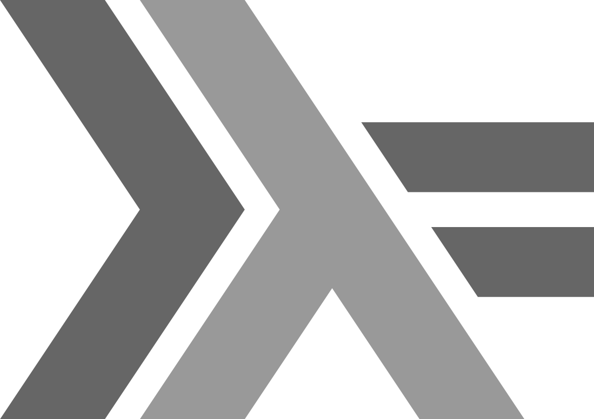

# Sobre o Curso

## Sobre o Curso

Baseado no curso de Bartosz Milewski disponível em https://bartoszmilewski.com/2014/10/28/category-theory-for-programmers-the-preface/

## Sobre o Curso

O material do curso está disponível em:

http://pesquisa.ufabc.edu.br/haskell/categorias.html

e

http://pesquisa.ufabc.edu.br/haskell/cursos/19.q2.categorias/

## Sobre o Curso

Os códigos estão disponíveis no repositório https://github.com/folivetti/Category4Programmers

## Sobre o Curso

Para obter o certificado de participação, o aluno deve fazer pelo menos 70% das atividades propostas submetidas no Github.

# Teoria das Categorias

## Teoria das Categorias

Teoria das Categorias é uma área da Matemática que formaliza, descreve e estuda estruturas abstratas com foco nas relações entre seus objetos.

## Teoria das Categorias

Uma categoria $C$ é definida como um conjunto de **objetos** e **morfismos** junto com um operador de composição $(\circ)$ que garantem as seguintes propriedades:

- **Associatividade:** $h \circ (g \circ f) = (h \circ g) \circ f = h \circ g \circ f$.
- **Identidade:** $f \circ id_A = id_B \circ f = f$.
- **Transitividade:** se $a, b, c \in C$ e $f : a \rightarrow b, g : b \rightarrow c$, então existe um $h = g \circ f: a \rightarrow c$.

## Propriedades

\centering
\begin{tikzpicture}[auto, scale=2, transform shape]
\node (a) {$a$};
\node (b) [right of=a] {$b$};
\node (c) [below of=b] {$c$};
\node (d) [below of=a] {$d$};

\draw[->] (a) to node {$f$} (b);
\draw[->] (b) to node {$g$} (c);
\draw[->] (c) to node {$h$} (d);

\draw[dashed,->, sloped, below] (a) to node {$$} (c);
\draw[dashed,->, sloped, below] (b) to node {$$} (d);

\draw[thick,->] (a) edge[loop above] (a);
\draw[thick,->] (b) edge[loop above] (b);
\draw[thick,->] (c) edge[loop below] (c);
\draw[thick,->] (d) edge[loop below] (d);
\end{tikzpicture}

## Composição e Abstração

Tanto o conceito de **composição** como de **abstração** são conhecidos na Ciência da Computação e entre programadores.

## Composição e Abstração

<blockquote class="twitter-tweet" data-lang="pt"><p lang="en" dir="ltr">Category theory is the study of compositionality: building big things out of little things, preserving guarantees.<br><br>It would be utterly _astonishing_ if this were not deeply useful for programming.<br><br>We have barely scratched the surface of learning how to take advantage of this!</p>&mdash; kenbot (@KenScambler) <a href="https://twitter.com/KenScambler/status/1117622023163826176?ref_src=twsrc%5Etfw">15 de abril de 2019</a></blockquote>
<script async src="https://platform.twitter.com/widgets.js" charset="utf-8"></script>

## Composição e Abstração

<blockquote class="twitter-tweet" data-lang="pt"><p lang="en" dir="ltr">&#39;The purpose of abstraction is not to be vague, but to create a new semantic level in which one can be absolutely precise&#39; - Edsger Dijkstra <a href="https://t.co/S6UruJbBjF">pic.twitter.com/S6UruJbBjF</a></p>&mdash; Computer Science (@CompSciFact) <a href="https://twitter.com/CompSciFact/status/948965367107465218?ref_src=twsrc%5Etfw">4 de janeiro de 2018</a></blockquote>
<script async src="https://platform.twitter.com/widgets.js" charset="utf-8"></script>

## Exemplo {.fragile}

```{.cpp frame=lines framerule=2pt linenos=true fontsize=\footnotesize baselinestretch=0.8}
char * inverte_str(char * orig) {
    int len = 0;
    char *ptr = orig, *dest, *pilha;
    int i, topo = -1;
    
    while (*ptr != '\0') ++ptr;
    len = ptr - orig;
    
    dest = malloc(sizeof(char)*(len+1));
    pilha = malloc(sizeof(char)*len);
  
    for (i=0; i<len; ++i) {
        pilha[++topo] = orig[i];
    }
    
    i = 0;
    while (topo != -1) dest[i++] = pilha[topo--];

    dest[len] = '\0';    
    free(pilha);    
    return dest;
}
```

## Exemplo com Modularização e Abstração {.fragile}

```{.cpp frame=lines framerule=2pt linenos=true fontsize=\footnotesize baselinestretch=0.8}
char * inverte_str(char * orig) {
    int len = strlen(orig);
    pilha * p = cria_pilha();
    char * dest;
          
    dest = cria_str(len);
    
    while (*orig != '\0') {
        empilha(p, *orig);
        ++orig;
    }

    while (!vazia(p)) {
        *dest = desempilha(p);
        ++dest;
    }
        
    return dest;
}
```

## Utilizando composição {.fragile}

```{.cpp frame=lines framerule=2pt linenos=true fontsize=\footnotesize baselinestretch=0.8}
char * inverte_str(char * orig) {
    pilha * p = cria_pilha();
    return desempilha_str(empilha_str(p, *orig));
}
```

## Pergunta

Quais vantagens vocês percebem nessa última versão?

## Resposta

- Construir o conceito de pilha uma única vez, utilizar em diversos contextos.
- Testar a corretude de cada módulo independentemente.
- Código declarativo
- Número menor de variáveis por módulo

## Fim do curso?

O uso de abstração e composição é apenas o começo...

## Fim do curso?

O estudo de Teoria das Categorias também compreende a identificação de padrões recorrentes.

Esses padrões são úteis para criações de estruturas genéricas que permitem lidar com diversos problemas recorrentes em programação.

## Pergunta

Como você definiria a categoria das páginas Web? Quem são os objetos e morfismos? As propriedades são atendidas?

## Pergunta

Como você definiria a categoria do Facebook? Quem são os objetos e morfismos? As propriedades são atendidas?

# Categoria para Programadores

## Categoria da Programação

Como podemos definir uma categoria apropriada para linguagens de programação? Quem são os objetos e morfismos?

## Categoria dos Tipos

**Categoria dos Tipos:** os objetos são os tipos de uma linguagem de programação (primitivos ou compostos) e os morfismos são as funções que mapeiam um valor de um tipo para outro.

## Tipo

Um **tipo** nada mais é que um conjunto de valores:

- `Int` compreende números inteiros representáveis com $32$ bits
- `Char` caracteres da tabela ASCII ou Unicode
- `Primo` conjunto de números primos
- `Bool` contém apenas dois valores: `True, False`

## Função {.fragile}

Representa um mapa do valor de um tipo para outro tipo (ou para o mesmo):

```C
bool f (int);
```

Por ora vamos assumir apenas funções com apenas um único argumento como parte dos morfismos.

## Haskell {.fragile}

Em Haskell a assinatura de uma função é similar a notação matemática:

```Haskell
f :: Bool -> Int
```

A função `f` mapeia um valor booleano para um inteiro.

## É uma categoria?

Para os tipos e funções formarem uma categoria eles devem conter um morfismo identidade, um operador de composição e obedecer três propriedades: **identidade**, **associatividade** e **transitividade**.

## Morfismo Identidade

A propriedade de identidade diz que existe um morfismo identidade (`id`) que pode receber qualquer tipo e retorna o mesmo valor de entrada para esse mesmo tipo.

## Haskell {.fragile}

```Haskell
id :: a -> a
id x = x
```

O tipo `a` é um tipo paramétrico, deve ser lido como *para qualquer a*.

## C++ {.fragile}

```C++
template <class A>
A id(A x) return x;
```

## Python {.fragile}

```Python
def id(x):
    return x
```

## Operador de Composição

O operador de composição $g \circ f$ pode ser lido como $g$ *após* $f$ e deve aplicar a função $g$ na  saída da função $f$.

## Haskell {.fragile}

O Haskell já possui um operador de composição:

```Haskell
(.) :: (b -> c) -> (a -> b) -> (a -> c)
g . f = \x -> g (f x)
```

Dada uma função $g : b \rightarrow c$ e uma função $f : a \rightarrow b$, me entregue uma função $g \circ f : a \rightarrow c$.

## C++ {.fragile}

O C++11 introduziu o conceito de funções anônimas que nos permitem fazer:

```{.cpp frame=lines framerule=2pt linenos=true fontsize=\footnotesize baselinestretch=0.8}
auto const compose = [](auto g, auto f) {
        return [f, g](auto x) {
                return g(f(x));
        };
};
```

## Python {.fragile}

Em Python fazemos:

```Python
def compose(g, f):
    return lambda x: g(f(x))
```

## Identidade {.fragile}

```{.haskell frame=lines framerule=2pt linenos=true fontsize=\footnotesize baselinestretch=0.8}
(f . id) x         = f x
(\x -> f (id x)) x = f x
(\x -> f x) x      = f x
f x                = f x
```

## Associatividade {.fragile}

```{.haskell frame=lines framerule=2pt linenos=true fontsize=\footnotesize baselinestretch=0.8}
(f . (g . h)) x        = ((f . g) . h) x
(f . (\x -> g (h x)) x = (\x -> (f . g)(h x)) x
(\y -> f ((\x -> g (h x) y)) x = (\x -> (\y -> f (g y))(h x)) x
f ((\x -> g (h x) x)  = (\y -> f (g y))(h x)
f (g (h x))           = f (g (h x))
```

## Transitividade

Consequência do nosso operador de composição.

# Monoids

## Monoids

O primeiro padrão que iremos aprender é uma categoria bastante simples, ela contém apenas um objeto!

\centering
\begin{tikzpicture}[auto, scale=2, transform shape]
\node[circle,draw=black!75] (a) {$a$};
\draw[thick,->] (a.90) arc (0:264:2mm);
\draw[thick,->] (a.90) arc (0:264:3mm);
\draw[thick,->] (a.90) arc (0:264:4mm);
\end{tikzpicture}

Essa categoria é conhecida como **Monoid**.

## Monoids

Em algebra um Monoid $M(C, \otimes, \epsilon_{\otimes})$ é composto por um objeto $C$, um operador binário $\otimes : m \rightarrow m \rightarrow m$, com $m \in C$ e um valor identidade $\epsilon_{\otimes}$ correspondente a esse operador.

## Propriedades

$a, b, c \in C, (a \otimes b) \otimes c = a \otimes (b \otimes c) = a \otimes b \otimes c$

$a \otimes \epsilon = \epsilon \otimes a = a$

## Monoids em Haskell {.fragile}

Em Haskell podemos criar uma classe de tipos:

```Haskell
class Monoid m where
    mempty  :: m
    mappend :: m -> m -> m
```

## Monoids em Haskell {.fragile}

Exemplo: multiplicação em números inteiros.

```Haskell
instance Monoid Int where
    mempty  = 1
    mappend = (*)
```

## Notação point-free

No Haskell as expressões `mappend x y = x*y` e `mappend = (*)` representam a mesma coisa!

Essa segunda expressão é chamada de *point-free* ou *igualdade extensional*.

## Monoids em C++ {.fragile}

Em C++20, podemos definir um Monoid como:

```{.cpp frame=lines framerule=2pt linenos=true fontsize=\footnotesize baselinestretch=0.8}
template<class T>
  T mempty = delete;

template<class T>
  T mappend(T, T) = delete;

template<class M>
  concept bool Monoid = requires (M m) {
    { mempty<M> } -> M;
    { mappend(m, m); } -> M;
  };
```

## Monoids em C++ {.fragile}

E o exemplo para inteiros com multiplicação (g++-8 com flags `-fconcepts -std=c++2a`):

```{.cpp frame=lines framerule=2pt linenos=true fontsize=\footnotesize baselinestretch=0.8} 
template<>
int mempty<int> = {1};

int mappend(int x, int y) {
    return x*y;
}
```

## Monoids em Python {.fragile}

Em Python utilizamos `singledispatch`:

```{.python frame=lines framerule=2pt linenos=true fontsize=\footnotesize baselinestretch=0.8}
from functools import singledispatch

@singledispatch
def mempty(a):
    raise Error("Not implemented for" + a)

@singledispatch
def mappend(a, b):
    raise Error("Not implemented for" + a)
```

## Monoids em Python {.fragile}

E o exemplo para inteiros com multiplicação: 

```{.python frame=lines framerule=2pt linenos=true fontsize=\footnotesize baselinestretch=0.8}
@mempty.register(int)
def _(a):
    return 1

@mappend.register(int)
def _(a,b):
    return a * b
```

## Sistema de Estoque {.fragile}

Vamos exemplificar com o seguinte trecho de código:

```{.haskell frame=lines framerule=2pt linenos=true fontsize=\footnotesize baselinestretch=0.8}
type Qtd     = Int
type Preco   = Double
data Produto = P Qtd Preco
               
soma_produtos :: [Produto] -> Produto
soma_produtos ps = foldl somaProds prod0 ps
  where 
    somaProds (P q1 p1) (P q2 p2) = P (q1+q2) (p1+p2)
    prod0 = P 0 0.0
  
zera_estoque :: Produto -> Produto
zera_estoque _ = P 0 0.0
```

## Sistema de Estoque {.fragile}

Se eu quiser acrescentar um campo imposto? O que devo fazer?

```{.haskell frame=lines framerule=2pt linenos=true fontsize=\footnotesize baselinestretch=0.8}
type Qtd     = Int
type Preco   = Double
type Imposto = Double
data Produto = P Qtd Preco Imposto
               
soma_produtos :: [Produto] -> Produto
soma_produtos ps = foldl somaProds prod0 ps
  where 
    somaProds (P q1 p1 i1) (P q2 p2 i2) = P (q1+q2) (p1+p2) 
                                                (max i1 i2)
    prod0 = P 0 0.0 0.0
  
zera_estoque :: Produto -> Produto
zera_estoque _ = P 0 0.0 0.0
```

## Sistema de Estoque

Se eu tiver $n$ funções que processam o tipo produto, tenho que fazer alteração em cada uma delas.

Devo tomar cuidado para que todas as alterações, repetitivas, sejam feitas corretamente!

## Monoid de Estoque {.fragile}

```{.haskell frame=lines framerule=2pt linenos=true fontsize=\footnotesize baselinestretch=0.8}
type Qtd     = Int
type Preco   = Double
data Produto = P Qtd Preco
               
instance Monoid Produto where
  mempty = Produto 0 0.0
  mappend (P q1 p1) (P q2 p2) = P (q1+q2) (p1+p2)
               
soma_produtos :: [Produto] -> Produto
soma_produtos ps = foldl mappend mempty ps
  
zera_estoque :: Produto -> Produto
zera_estoque _ = mempty
```

## Monoid de Estoque {.fragile}

```{.haskell frame=lines framerule=2pt linenos=true fontsize=\footnotesize baselinestretch=0.8}
type Qtd     = Int
type Preco   = Double
type Imposto = Double
data Produto = P Qtd Preco Imposto
               
instance Monoid Produto where
  mempty = Produto 0 0.0 0.0
  mappend (P q1 p1 i1) (P q2 p2 i2) = P (q1+q2) (p1+p2) 
                                            (max i1 i2)
               
soma_produtos :: [Produto] -> Produto
soma_produtos ps = foldl mappend mempty ps
  
zera_estoque :: Produto -> Produto
zera_estoque _ = mempty
```

## Monoid de Estoque

Agora eu só preciso alterar a instância de Monoid para o tipo Produto! Isso será feito uma única vez! Todas as outras funções continuam funcionando corretamente.

# Categoria Kleisli

## Traço de Execução {.fragile}

Imagine que temos diversas funções em C++, como por exemplo:

```{.cpp frame=lines framerule=2pt linenos=true fontsize=\footnotesize baselinestretch=0.8}
bool not(bool b) {
    return !b;
}

bool is_even(int x) {
    return x%2==0;
}
```

## Traço de Execução {.fragile}

Precisamos criação um *log* do traço de execução de cada função no programa. Algo como:

```{.cpp frame=lines framerule=2pt linenos=true fontsize=\footnotesize baselinestretch=0.8}
int main () {
   not(is_even(2));
   not(is_even(3));
}
```

resultaria no *log* "even not even not". Quais soluções podemos propor?

## Traço de Execução {.fragile}

Alteramos todas as funções para retornarem `pair<T, string>` e concatenamos o log na função principal:

```{.cpp frame=lines framerule=2pt linenos=true fontsize=\footnotesize baselinestretch=0.8}
pair<bool, string> not(bool b) {
    return make_pair(!b, "not ");
}

pair<bool, string> is_even(int x) {
    return make_pair(x%2==0, "even ");
}
```

## Traço de Execução {.fragile}

```{.cpp frame=lines framerule=2pt linenos=true fontsize=\footnotesize baselinestretch=0.8}
int main () {
   pair<bool, string> p;
   string log = "";
   
   p = is_even(2);
   log += p.second;
   p = not(p.first);
   log += p.second;
   
   p = is_even(3);
   log += p.second;
   p = not(p.first);
   log += p.second;
}
```

## Traço de Execução

Código confuso, verboso, trabalhoso (aumentando a chance de *bugs*).

As funções não podem ser compostas como `not(is_even(3))`.

## Traço de Execução {.fragile}

Para facilitar usamos uma variável global:

```{.cpp frame=lines framerule=2pt linenos=true fontsize=\footnotesize baselinestretch=0.8}
string log = "";

bool not(bool b) {
    log += "not ";
    return !b;
}

bool is_even(int x) {
    log += "even ";
    return x%2==0;
}
```

## Traço de Execução {.fragile}

Nosso código precisa de poucas alterações e as funções continuam com a propriedade de composição:

```{.cpp frame=lines framerule=2pt linenos=true fontsize=\footnotesize baselinestretch=0.8}
int main () {
   not(is_even(2));
   not(is_even(3));
}
```

## Traço de Execução

\centering
{width=400px}

## Efeito colateral

Cometemos um erro grave. Transformamos todas as nossas funções puras em funções com efeitos colaterais...

## Funções Puras {.fragile}

Uma função $f$ é pura se, para um mesmo valor de entrada, ela **sempre** retorna a mesma saída (inclusive suas saídas escondidas):

```{.python frame=lines framerule=2pt linenos=true fontsize=\footnotesize baselinestretch=0.8}
def f(x):
  return 2*x
```

## Função impura {.fragile}

Funções que retornam valores distintos ou causam um efeito em alguma outra forma de saída (arquivo, banco de dados, etc.):

```{.python frame=lines framerule=2pt linenos=true fontsize=\footnotesize baselinestretch=0.8}
def multRand(x):
    return random()*x
```

## Função impura {.fragile}

```{.python frame=lines framerule=2pt linenos=true fontsize=\footnotesize baselinestretch=0.8}
def escreve(s):
    with open("arq.txt","a") as f:
        f.write(s)
    with open("arq.txt","r") as f:
        lines = f.readlines()
    return lines
```

## Função Pura vs Impura

Para testar a pureza de uma função podemos tentar **memoizar**. Se eu puder memoizar, então ela é pura, caso contrário não.

## Pergunta {.fragile}

Essa função é pura ou impura?

```{.cpp frame=lines framerule=2pt linenos=true fontsize=\footnotesize baselinestretch=0.8}
int fatorial(int n) {
  if (n <= 0) return 0;
  if (n == 1) return 1;
  return n * fatorial(n-1);
}
```

## Pergunta {.fragile}

Essa função é pura ou impura?

```{.cpp frame=lines framerule=2pt linenos=true fontsize=\footnotesize baselinestretch=0.8}
std::getchar()
```

## Pergunta {.fragile}

Essa função é pura ou impura?

```{.cpp frame=lines framerule=2pt linenos=true fontsize=\footnotesize baselinestretch=0.8}
bool f() { 
    std::cout << "Hello!" << std::endl;
    return true; 
}
```

## Pergunta {.fragile}

Essa função é pura ou impura?

```{.cpp frame=lines framerule=2pt linenos=true fontsize=\footnotesize baselinestretch=0.8}
int f(int x) {
    static int y = 0;
    y += x;
    return y;
}
```

## Efeitos colaterais e bugs

Funções que causam efeitos colaterais devem ser evitadas ou muito bem documentadas e isoladas de todo o resto do programa pois

- Dependem de fontes externas que podem não ser confiáveis.
- Podem danificar essas fontes externas causando falhas em outras funções impuras.
- Mascarar alterações em uma estrutura de dados sendo utilizada (ex.: listas em Python)

## Traço de Execução {.fragile}

Retomando nosso problema, não tem outro jeito exceto a primeira solução verbosa, feia, trabalhosa :(

```{.cpp frame=lines framerule=2pt linenos=true fontsize=\footnotesize baselinestretch=0.8}
pair<bool, string> is_odd(int x) {
    pair<bool, string> p1, p2;
    p1 = is_even(x);
    p2 = not(p1.first);
    return make_pair(p2.first, p1.second + p2.second);
    
}
```

## Traço de Execução {.fragile}

Mas peraí, tem um padrão aí!

```{.cpp frame=lines framerule=2pt linenos=true fontsize=\footnotesize baselinestretch=0.8}
pair<bool, string> is_not_odd(int x) {
    pair<bool, string> p1, p2;
    p1 = is_odd(x);
    p2 = not(p1.first);
    return make_pair(p2.first, p1.second + p2.second);
    
}
```

## Traço de Execução

Nosso objetivo é fazer com que as funções se conversem de forma natural. Vamos tentar criar uma categoria para esse tipo de função!

## Traço de Execução {.fragile}

Vamos voltar a usar o Haskell por conta de sua notação mais próxima da matemática. Temos funções:

```{.haskell frame=lines framerule=2pt linenos=true fontsize=\footnotesize baselinestretch=0.8}
is_even :: Int  -> (Bool, String)
not     :: Bool -> (Bool, String)
```

## Traço de Execução {.fragile}

E queremos criar um operador de composição para elas:

```{.haskell frame=lines framerule=2pt linenos=true fontsize=\footnotesize baselinestretch=0.8}
compose :: (a -> (b, String)) 
        -> (b -> (c, String)) 
        -> (a -> (c, String))
```

## Traço de Execução {.fragile}

Para facilitar a notação, vamos criar o tipo `Writer` definido por:

```{.haskell frame=lines framerule=2pt linenos=true fontsize=\footnotesize baselinestretch=0.8}
type Writer a = (a, String)
```

## Categoria Writer

Para que o tipo `Writer` forme uma categoria, precisamos de uma função composição e uma identidade.

A função identidade deve ter como propriedade $f \circ id = id \circ f = f$.

## Composição: >=> {.fragile}

A composição é feita pelo operador conhecido como *peixe*:

```{.haskell frame="lines" framerule="2pt" linenos=true fontsize=\footnotesize baselinestretch=0.8}
(>=>) :: (a -> Writer b) -> (b -> Writer c) -> (a -> Writer c)
m1 >=> m2 = \a ->
    let (b, s1) = m1 a
        (c, s2) = m2 b
    in (c, s1 ++ s2)
```

## Categoria Writer {.fragile}

```{.haskell frame=lines framerule=2pt linenos=true fontsize=\footnotesize baselinestretch=0.8}
notW :: Bool -> Writer Bool
notW b = (b, "not")

is_even :: Int -> Writer Bool
is_even x = (x `mod` 2 == 0, "even")

is_odd :: Int -> Writer Bool
is_odd = is_even >=> notW
```

## Identidade Writer {.fragile}

Pensando na composição, como deve ser nossa função identidade?

```{.haskell frame=lines framerule=2pt linenos=true fontsize=\footnotesize baselinestretch=0.8}
(id >=> f) = \a ->
  let (b, s1) = id a
      (c, s2) = f b
  in (c, s1 ++ s2)
```

Para que a função seja identidade temos que `b = a` e `s1 ++ s2 = s2`.

## Identidade Writer {.fragile}

Vamos analisar se essa função atende nossa propriedade:

```{.haskell frame=lines framerule=2pt linenos=true fontsize=\footnotesize baselinestretch=0.8}
return :: a -> Writer a
return x = (x, "")
```

(o nome `return` será explicado no final do curso)

## Pergunta

Utilizamos a string vazia na função `return` por ela ser um elemento neutro da concatenação. Tenho um elemento neutro, um operador binário (concatenação) e o tipo `String`. O que isso forma?


## Categoria Writer C++ {.fragile}

```{.cpp frame=lines framerule=2pt linenos=true fontsize=\footnotesize baselinestretch=0.8}
template<class A>
Writer<A> identity(A x) {
    return make_pair(x, "");
}
```

## Categoria Writer C++ {.fragile}

```{.cpp frame=lines framerule=2pt linenos=true fontsize=\footnotesize baselinestretch=0.8}
auto const compose = [](auto m1, auto m2) {
    return [m1, m2](auto a) {
        auto p1 = m1(a);
        auto p2 = m2(p1.first);
        return make_pair(p2.first, p1.second + p2.second);
    };
};
```

## Categoria Writer C++ {.fragile}

```{.cpp frame=lines framerule=2pt linenos=true fontsize=\footnotesize baselinestretch=0.8}
Writer<bool> notW(bool b) {
    return make_pair(!b, "not ");
}

Writer<bool> is_even(int x) {
    return make_pair(x%2==0, "even ");
}

Writer<bool> is_odd(int x) {
    return compose(is_even, notW)(x);
}
```

## Categoria Kleisli

Essa categoria que acabamos de criar é generalizada pela categoria **Kleisli** que é um dos componentes da definição de **Monads** (mas ainda é cedo pra dizer que sabem o que é um Monad).

## Categoria Kleisli

Generalizando, a categoria Kleisli possui os mesmos objetos da categoria dos tipos...

...porém os morfismos são da forma `a -> m b`.

## Exercício {.fragile}

O que acontece se alterarmos a definição de `Writer` para carregar um inteiro no segundo componente?

```{.haskell frame="lines" framerule="2pt" linenos=true fontsize=\footnotesize baselinestretch=0.8}
type Writer a = (a, Int)

(>=>) :: (a -> Writer b) -> (b -> Writer c) -> (a -> Writer c)
m1 >=> m2 = \x ->
    let (y, s1) = m1 x
        (z, s2) = m2 y
    in (z, s1 + s2)
```

## Exercício {.fragile}

```{.haskell frame=lines framerule=2pt linenos=true fontsize=\footnotesize baselinestretch=0.8}
fatorial :: Int -> Writer Int
fatorial 0 = (1,1)
fatorial 1 = (1,1)
fatorial n = (fatorial >=> (mul n)) (n-1)

mul :: Int -> Int -> Writer Int
mul n x = (n*x, 1)


main = do
    print $ fatorial 5
```

## Writer para funções impuras

A nossa definição do tipo `Writer` nos permitiu transformar uma solução que gera efeitos colaterais em uma função pura!

## Categoria Kleisli para funções parciais

Uma função parcial é aquela que não tem um valor definido para todos os possíveis argumentos. Exemplo: raíz quadrada para números reais.

## Categoria Kleisli para funções parciais {.fragile}

Uma forma de tratar esse tipo de função é utilizando o tipo `Maybe` no Haskell:

```Haskell
data Maybe a = Nothing | Just a
```

## Categoria Kleisli para funções parciais {.fragile}

E `optional` no C++:
 
```{.cpp frame=lines framerule=2pt linenos=true fontsize=\footnotesize baselinestretch=0.8}
template<class A> class optional {
    bool _isValid;
    A    _value;
public:
    optional()    : _isValid(false) {}
    optional(A v) : _isValid(true), _value(v) {}
    bool isValid() const { return _isValid; }
    A value() const { return _value; }
};
```

## Categoria Kleisli para funções parciais {.fragile}

Vamos supor a existência de duas funções `safe_root` e `safe_reciprocal`:


```{.cpp frame=lines framerule=2pt linenos=true fontsize=\footnotesize baselinestretch=0.8}
optional<double> safe_root(double x) {
    if (x >= 0) return optional<double>{sqrt(x)};
    else return optional<double>{};
}

optional<double> safe_reciprocal(double x) {
	if (x != 0) return optional<double>{1.0/x};
	else return optional<double>{};
}
```

## Categoria Kleisli para funções parciais {.fragile}

Nosso operador *peixe* para compor duas funções que retornam `optional` devem seguir a lógica:

- Se o resultado da primeira função for **nada**, retorna nada. Senão, passa o resultado como argumento para a segunda função.
- Se o resultado da segunda função for **nada**, retorna nada. Senão retorna o resultado.

## Categoria Kleisli para funções parciais {.fragile}

```{.cpp frame=lines framerule=2pt linenos=true fontsize=\footnotesize baselinestretch=0.8}
auto const fish = [](auto f, auto g) {
	return [f, g](double x) {
		auto z = f(x);
		if (z) return g(z.value());
		else return z;
	};
};
```

## Categoria Kleisli para funções parciais {.fragile}

Com isso podemos fazer a sequência:

```C++
auto sequencia = fish(safe_reciprocal, safe_root);
```

# Tipos de Dados Algébricos

## Tipos Fundamentais

Podemos analisar os tipos em uma linguagem de programação pela quantidade de elementos que eles representam e as funções que eles podem fazer parte como entrada ou saída.

## Tipos Fundamentais

Dentre os tipos listados anteriomente, o menor deles foi o `Bool`, contendo apenas dois elementos.

## Absurdo!

Podemos pensar em um tipo com $0$ elementos?

## Void {.fragile}

No Haskell temos o tipo `Void` definido por:

```{.haskell frame=lines framerule=2pt linenos=true}
data Void
```

Não existe equivalente em C++ ou Python.

## Funções com Void {.fragile}

Que tipo de funções podemos criar com `Void`? 

```{.haskell frame=lines framerule=2pt linenos=true}
absurd :: Void -> a
```

Essa função é equivalente a lei da lógica clássica *ex falso quodlibet* que diz que *qualquer coisa pode seguir de uma contradição*.

## Unit {.fragile}

E um tipo com apenas um elemento?

```{.haskell frame=lines framerule=2pt linenos=true}
data () = ()
```

ele é chamado de **unit** e é implementado pelo tipo `void` no C/C++/Java e `None` no Python.

## Funções com Unit {.fragile}

Que funções podemos construir que retorna um unit?

```{.haskell frame=lines framerule=2pt linenos=true}
unit :: a -> ()
unit x = ()
```

## Funções com Unit {.fragile}

E funções que recebem um unit?

```{.haskell frame=lines framerule=2pt linenos=true}
x :: () -> Int
x () = 10
```

que, nesse exemplo, escolhe um valor do tipo `Int`.

## Exercício: Funções com Bool

Que tipos de funções construímos com o tipo `Bool`?

## Exercício: Funções com Bool {.fragile}

Que tipos de funções construímos com o tipo `Bool`?

```{.haskell frame=lines framerule=2pt linenos=true}
isAlpha :: Char -> Bool
isGreaterThanFive :: Int -> Bool
```

Predicados!

## Exercício: Funções com Bool {.fragile}

Que tipos de funções construímos com o tipo `Bool`?

```{.haskell frame=lines framerule=2pt linenos=true}
ifthenelse :: Bool -> Int
ifthenelse True  = 10
ifthenelse False = 20
```

## Tipos Compostos

Digamos que eu tenha uma função que recebe um `Bool` e, dependendo do valor, deve retornar ou um inteiro, ou um caracter.

Também pense no tipo que representa produtos em nosso estoque, eles são compostos por `Int` e `Double`, como represento tais tipos?

Vamos definir os tipos **produtos** e **soma** (**coprodutos**)

## Tipo Produto

**Spoiler:** o tipo produto é uma tupla.

## Tipo Produto

Como definimos uma tupla utilizando Teoria das Categorias?

## Construção Universal

Na Teoria das Categorias temos uma visão *de fora* dos objetos, ou seja, não temos acesso ao seu conteúdo. Isso permite criar estruturas abstratas.

## Construção Universal

A Construção Universal é feito em dois passos:

- Criamos um padrão que compreende o que nos interessa (e outros que não).
- Criamos um rank para que o que nos interessa fique em primeiro lugar.

## Tipo Produto {.fragile}

O tipo $c$ é um tipo produto dos tipos $a$ e $b$. O padrão que define $c$ é a de duas funções de projeção:

```{.haskell frame=lines framerule=2pt linenos=true}
p :: c -> a
q :: c -> b
```

## Tipo Produto {.fragile}

Basicamente procuramos pelo seguinte padrão:

\centering
\begin{tikzpicture}[auto, scale=2, transform shape]
\node (c) {$c$};
\node (a) [below left of=c, yshift=-10] {$a$};
\node (b) [below right of=c, yshift=-10] {$b$};
\draw[->, black,solid,line width=1mm,fill=black] (c) edge node[above, xshift=-1, yshift=-5] {$p$} (a);
\draw[->, black,solid,line width=1mm,fill=black] (c) edge node[yshift=-5] {$q$} (b);
\end{tikzpicture}

## Tipo Produto {.fragile}

Para exemplificar, vamos imaginar que nosso objetivo é obter o produto entre um `Int` e um `Bool`.

Se definirmos `c :: Int` conseguimos implementar `p, q`?

## Tipo Produto {.fragile}

Podemos definir `c :: Int` fazendo:

```{.haskell frame=lines framerule=2pt linenos=true}
p :: Int -> Int
p x = x

q :: Int -> Bool
q _ = True
```

## Tipo Produto {.fragile}

Se definirmos `c :: (Int, Int, Bool)` conseguimos implementar `p, q`?

## Tipo Produto {.fragile}

```{.haskell frame=lines framerule=2pt linenos=true}
p :: (Int, Int, Bool) -> Int
p (x, _, _) = x

q :: (Int, Int, Bool) -> Bool
q (_, _, b) = b
```

## Tipo Produto {.fragile}

Se definirmos `c :: (Int, Bool)` conseguimos implementar `p, q`?

## Tipo Produto {.fragile}

```{.haskell frame=lines framerule=2pt linenos=true}
p :: (Int, Bool) -> Int
p (x, _) = x -- fst

q :: (Int, Bool) -> Bool
q (_, b) = b -- snd
```

## Tipo Produto {.fragile}

Para rankear nossos candidatos e encontrar o **melhor** tipo produto, dizemos que, dado $c, c'$ e os morfismos $p, q, p', q'$, $c$ é melhor que $c'$ se existe apenas um único $m$ tal que:

```{.haskell frame=lines framerule=2pt linenos=true}
m :: c' -> c

p' = p . m
q' = q . m
```

## Tipo Produto {.fragile}

Pensando na opção $c = (Int, Bool)$ e nas alternativas anteriores, vamos criar `m1, m2` que satisfaça as propriedades.

## Tipo Produto {.fragile}

Podemos fazer:

```{.haskell frame=lines framerule=2pt linenos=true}
m1 x = (x, True)

m2 (x, _, b) = (x, b)
```

## Tipo Produto {.fragile}

Vamos tentar fazer o oposto agora, encontrar um `m2'` que converta `c :: (Int, Bool)` em `c' :: (Int, Int, Bool)`!

## Tipo Produto {.fragile}

```{.haskell frame=lines framerule=2pt linenos=true}
m2' (x, b) = (x, 1, b)
```

## Tipo Produto {.fragile}

Mas também podemos fazer:

```{.haskell frame=lines framerule=2pt linenos=true}
m2' (x, b) = (x, 2, b)
```

## Tipo Produto

Conclusão: o melhor tipo para representar o nosso tipo produto é uma tupla!

## Exercício 

O tipo produto `((Int, Bool), Int)` é isomorfos com o tipo `(Int, (Bool, Int))`? Defina duas funções que converta uma em outra e sejam inversas.

## Isomorfismo

**Isomorfismo:** relação que indica que dois objetos são estruturalmente iguais.

Nem sempre conseguimos comparar dois objetos por igualdade.


## Isomorfismo {.fragile}

Um objeto `a` é isomorfos ao objeto `b` se temos:

```Haskell
f . g = id
g . f = id
```

## Exercício

Fazendo `a = Int` como a quantidade de valores contidos no tipo `Int` e, analogamente, `b = Bool` como a quantidade de valores no tipo `Bool`. Quantos valores possui o tipo `(Int, Bool)`?

## Tipo Algébrico Produto

Como temos um tipo chamado *produto*, será que ele possui as mesmas propriedades algébricas de um produto? Já vimos que ele é associativo...

## Tipo Algébrico Produto {.fragile}

Na álgebra o produto possui um elemento neutro, que tem valor $1$. Na categoria dos tipos, o unit representa esse valor.

Prove que `(a, ())` é isomorfo a `a`.

## Tipo Algébrico Produto {.fragile}

```{.haskell frame=lines framerule=2pt linenos=true}
f :: (a, ()) -> a
f (x, ()) = x

g :: a -> (a, ())
g x = (x, ())

f . g = id
g . f = id
```

Ou seja, o tipo `(a, ())` (e analogamente `((), a)`) são isomorfos a `a`, pois carregam a mesma informação.

## Uma palavra sobre o Haskell

\centering
{width=400px}


## Tipo Produto no Haskell {.fragile}

No Haskell, podemos representar pares utilizando nomes específicos para diferenciar um par de outro:

```{.haskell frame=lines framerule=2pt linenos=true}
data Circunferencia     = Circ Double Double Double
data TrianguloRetangulo = Tri Double Double Double
```

## Tipo Produto no Haskell {.fragile}

Nesse código `Circunferencia` é o nome do tipo criado e `Circ` é o nome do construtor desse tipo:

```{.haskell frame=lines framerule=2pt linenos=true}
Circ :: Double -> Double -> Double -> Circunferencia
```

## Tipo Produto no Haskell {.fragile}

Embora os tipos `Circunferencia` e  `TrianguloRetangulo` sejam isomórficos, no Haskell um não pode ser utilizado no lugar do outro (como poderiam em Python e C++):

```{.haskell frame=lines framerule=2pt linenos=true}
area :: Circunferencia -> Double
area (Circ xc yc r) = pi*r*r

tri :: TrianguloRetangulo
tri = Tri 10.0 10.0 5.0

z = area tri
```

## Type-driven Development

Esse código apresentará um erro de compilação, pois o Haskell exige que os tipos da assinatura de função e seus argumentos sejam os mesmos. 

## Type-driven Development

Lema do Haskell: *"if a Haskell program compiles, it probably works"* pois o sistema de tipos da linguagem impede que você passe argumentos para funções que sejam isomórficos porém representam diferentes contextos.

## Type-driven Development

Essa ideia é atualmente estudada com o nome de **Type-driven Development**, em que o objetivo é dificultar a compilação de um programa de tal forma que, quando ele compila corretamente, minimiza as chances de *bugs*. 

## Tipo Produto no Haskell {.fragile}

Também podemos representar um produto como um registro:

```{.haskell frame=lines framerule=2pt linenos=true}
data Circunferencia = Circ { x_center :: Double
                           , y_center :: Double
                           , radius   :: Double }
                           
area :: Circunferencia -> Double
area c = pi*r*r where r = radius c
```

## Fim da propaganda!

\centering
{width=400px}

## Tipo Coproduto {.fragile}

Vamos pensar agora no padrão dual ao produto, chamado **coproduto**:

```{.haskell frame=lines framerule=2pt linenos=true}
i :: a -> c
j :: b -> c
```

Nesse padrão estamos injetando valores do tipo `a` ou `b` em `c`. Temos uma **união** de conjuntos.

## Tipo Coproduto {.fragile}


\centering
\begin{tikzpicture}[auto, scale=2, transform shape]
\node (c) {$c$};
\node (a) [below left of=c, yshift=-10] {$a$};
\node (b) [below right of=c, yshift=-10] {$b$};
\draw[->, black,solid,line width=1mm,fill=black] (a) edge node[above, yshift=-5, xshift=-3] {$i$} (c);
\draw[->, black,solid,line width=1mm,fill=black] (b) edge node[above, yshift=-5, xshift=4] {$j$} (c);
\end{tikzpicture}


## Tipo Coproduto {.fragile}

Basta invertermos as setas do tipo produto para obter a fatoração do melhor tipo coproduto:

```{.haskell frame=lines framerule=2pt linenos=true}
m :: c -> c'

i' = m . i
j' = m . j
```

## Tipo Coproduto

O **tipo coproduto** ou **tipo soma** de dois objetos `a` e `b` é o objeto `c` equipado com duas funções injetivas para `a` e `b`.


## Tipo Coproduto {.fragile}

É uma união disjunta de dois conjuntos. Em Haskell podemos definir um tipo soma como:

```{.haskell frame=lines framerule=2pt linenos=true}
data C = A Int | B Bool
```

Lemos essa definição como "O tipo `C` é composto de **ou** um componente `A` do tipo `Int` **ou** um componente `B` do tipo `Bool`. 

## Tipo Coproduto {.fragile}

Uma forma mais genérica é obtida pelo tipo paramétrico `Either`:

```{.haskell frame=lines framerule=2pt linenos=true}
data Either a b = Left a | Right b
```

## Tipo Coproduto {.fragile}

Em C++ implementamos o tipo soma como um *tagged union*:

```C++
template<class A, class B>
struct Either {
    enum { isLeft, isRight } tag;
    union { A left; B right; };
};
```

## Tipo Coproduto {.fragile}

Um outro exemplo de tipo soma no Haskell é o tipo `Bool` definido como:

```{.haskell frame=lines framerule=2pt linenos=true}
data Bool = True | False
```

que é isomorfo a:

```{.haskell frame=lines framerule=2pt linenos=true}
data Bool = Either () ()
```

Provem!

## Tipo Coproduto / Maybe {.fragile}

Um exemplo de tipo soma que vimos recentemente é o `Maybe`:

```{.haskell frame=lines framerule=2pt linenos=true}
data Maybe a = Nothing | Just a -- = Either () a
```

## Álgebra dos Tipos {.fragile}

Será que podemos representar outras regras de soma e produto com tipos?

```{.haskell frame=lines framerule=2pt linenos=true fontsize=\footnotesize baselinestretch=0.8}
-- a * 0 = 0
data Absurdo a = Ab a Void = Void

-- a * 1 = a
data Unity a = U a () = a

-- a + 0 = a
data Soma0 a = A a | Void = a
```

## Álgebra dos Tipos {.fragile}

Esses tipos também possuem propriedades distributivas entre eles? 

```{.haskell frame=lines framerule=2pt linenos=true fontsize=\footnotesize baselinestretch=0.8}
type Alpha a b c = (a, (Either b c))

type Beta a b c = Either (a, b) (a, c)
```

## Álgebra dos Tipos {.fragile}

```{.haskell frame=lines framerule=2pt linenos=true fontsize=\footnotesize baselinestretch=0.8}
f :: Alpha -> Beta
f (x, Left y)  = Left (x, y)
f (x, Right y) = Right (x, y)

g :: Beta -> Alpha
g Left (x, y)  = (x, Left y)
g Right (x, y) = (x, Right y)
```

## Semi-Anel {.fragile}

Tanto o tipo Soma como o tipo Produto formam um Monoid e essa combinação forma um **semi-anel**:

```{.haskell frame=lines framerule=2pt linenos=true fontsize=\footnotesize baselinestretch=0.8}
instance Monoid Soma where
    mempty  = Void
    mappend = Either
    
instance Monoid Prod where
    mempty  = ()
    mappend = (,)
```

## Equivalência Álgebra-Tipos

Temos a seguinte tabela de equivalência entre a algebra e os tipos soma e produto:

| Algebra     | Tipos                        |
|-------------|------------------------------|
| $0$         | `Void`                       |
| $1$         | `()`                         |
| $a + b$     | Either a b                   |
| $a * b$     | (a, b)                       |
| $2 = 1 + 1$ | `Bool = True | False`        |
| $1 + a$     | `Maybe a = Nothing | Just a` |


## Equivalência Lógica-Tipos

Da mesma forma que os tipos em Haskell são isomórficos ao semi-anel da álgebra, eles também são isomórficos com a lógica clássica:


| Lógica      | Tipos                        |
|-------------|------------------------------|
| Falso       | `Void`                       |
| Verdadeiro  | `()`                         |
| $a \lor b$  | Either a b                   |
| $a \land b$ | (a, b)                       |


Esse isomorfismo é conhecido como *Isomorfismo de Curry-Howard* e pode ser estendido para categorias.

## Tipos Recursivos {.fragile}

Uma outra forma interessante de construção de tipos é através da recursão. Por exemplo, considere o tipo que representa uma lista em Haskell:

```{.haskell frame=lines framerule=2pt linenos=true}
data List a = Vazio | a : (List a)
```

## Tipos Recursivos {.fragile}

Essencialmente isso nos permite definir uma lista como:

```{.haskell frame=lines framerule=2pt linenos=true}
xs = List Int
xs = 1 : 2 : 3 : Vazio
```

que representa a lista `[1,2,3]`.

## Lista

Quantos valores possíveis temos para um tipo `List a`? Podemos resolver isso algebricamente definindo `x = List a`.

## Lista

$x = 1 + a \cdot x$

$x = 1 + a \cdot (1 + a \cdot x)$

$x = 1 + a + a^2 \cdot x$

$x = 1 + a + a^2 + a^3 \cdot x$

$x = 1 + a + a^2 + a^3  + a^4 + \ldots$

## Lista

Esse resultado pode ser interpretado como:

| Uma lista do tipo `a` pode conter um único valor (lista vazia) **ou** um valor do tipo `a` **ou** dois valores do tipo `a`, etc.

# Tipos Buracos

## Mais e mais álgebra

O que mais podemos fazer com os tipos algébricos? Uma outra operação possível é o cálculo da derivada de nossos tipos!

## Derivada de Tipos {.fragile}

Vamos estabelecer algumas derivadas básicas em função de um tipo `a`:

```{.haskell frame=lines framerule=2pt}
()'    = Void
a'     = ()
(a+b)' = () + Void
(a*b)' = 1*b = b
(a*a)' = 2a = a + a
```

## Tipos Buracos

Os tipos resultantes da derivada são chamados de **buracos** pois elas criam um ponto de foco na nossa estrutura.

## Buraco de uma Lista

A representação algébrica da lista é:

$x = 1 + a \cdot x$

Isolando a variável $x$ temos:

$x = 1/(1-a)$

Derivando esse tipo, temos:

$x' = 1/(1-a)^2$

## Buraco de uma Lista

$x' = 1/(1-a)^2 = (1/(1-a)) \cdot (1/(1-a))$

O que é isso?

## Buraco de uma Lista {.fragile}

O buraco de uma lista é o produto de duas listas!

## Buraco de uma Lista {.fragile}

O tipo buraco da lista é conhecido como *Zipper*. A ideia é que, dada uma lista encadeada, essa estrutura permite otimizar o percurso na estrutura.

## Buraco de uma Lista {.fragile}

A ideia é que a lista da direita armazene como primeiro elemento o *foco* atual e todos os elementos que aparecem após esse foco.

A lista da esquerda armazena os elementos anteriores, porém em ordem inversa, para otimizar o percurso.

## Buraco de uma Lista {.fragile}

```haskell
[] [1,2,3,4,5] -- direita
[1] [2,3,4,5] -- direita
[2,1] [3,4,5] -- direita
[3,2,1] [4,5] -- esquerda
[2,1] [3,4,5]
```

## Buraco de uma Lista {.fragile}

A estrutura `Zipper` é definida como:


```{.haskell frame=lines framerule=2pt linenos=true fontsize=\footnotesize baselinestretch=0.8}
data Zipper a = Zip [a] [a]

criaZip :: [a] -> Zipper a
criaZip xs = Zip [] xs
```

## Buraco de uma Lista {.fragile}

Para andar para esquerda, precisamos recuperar o elemento da primeira lista e inserir no começo da segunda lista:

```{.haskell frame=lines framerule=2pt linenos=true fontsize=\footnotesize baselinestretch=0.8}
esq :: Zipper a -> Zipper a
esq (Zip []     ds) = Zip [] ds
esq (Zip (e:es) ds) = Zip es (e:ds)
```

## Buraco de uma Lista {.fragile}

Para andar para direita, precisamos remover o elemento-foco e inserir no começo da primeira lista:

```{.haskell frame=lines framerule=2pt linenos=true fontsize=\footnotesize baselinestretch=0.8}
dir :: Zipper a -> Zipper a
dir (Zip es [])     = Zip es []
dir (Zip es (d:ds)) = Zip (d:es) ds
```

## Buraco de uma Lista {.fragile}

Com isso definimos uma lista duplamente ligada:

```{.haskell frame=lines framerule=2pt linenos=true fontsize=\footnotesize baselinestretch=0.8}
xs :: [Int]
xs = [1,2,3,4,5]

zs :: Zipper Int
zs = criaZip xs
-- zs = Zip [] [1,2,3,4,5]

zs' :: Zipper Int
zs' = (dir . dir) zs
-- zs' = Zip [2,1] [3,4,5]

zs'' :: Zipper Int
zs'' = esq zs'
-- zs'' = Zip [1] [2,3,4,5]
```

## Buraco de uma árvore {.fragile}

Outro `Zipper` interessante pode ser criado a partir de uma árvore com elemento apenas nos nós internos:

```{.haskell frame=lines framerule=2pt}
data Tree a = Empty | Node (Tree a) a (Tree a)
```

## Buraco de uma árvore {.fragile}

Algebricamente `Tree a = 1 + a * (Tree a) * (Tree a)` e substituindo `Tree a` por $x$, temos:

$x = 1 + a*x^2$

## Buraco de uma árvore {.fragile}

Derivando em função de $a$ temos:

$x' = x^2 + 2*a*x*x'$

Que pode ser resolvido como:

$x' = (x^2)/(1 - 2ax) = x^2 \cdot 1/(1 - (ax+ax))$

## Buraco de uma árvore {.fragile}

Transformando em um tipo algébrico, isso representa o produto entre uma tupla de árvores e uma lista com o foco atual, a árvore acima e o caminho utilizado, ou 

```Haskell
(Tree a, Tree a, [Either (a, Tree a)])
```

## Buraco de uma árvore {.fragile}

Em Haskell podemos escrever essa estrutura como:

```{.haskell frame=lines framerule=2pt linenos=true fontsize=\footnotesize baselinestretch=0.8}
data Zipper a = Zip { left  :: Tree a
                    , right :: Tree a
                    , focus :: [Either (a, Tree a) (a, Tree a)]
                    }
```

## Buraco de uma árvore {.fragile}

Então o foco em um elemento $x$ nessa árvore binária é composta por:

- ramo da esquerda
- ramo da direita
- lista de subárvores acima, sendo o primeiro elemento o nó-foco

Cada subárvore é sinalizada com `Left` ou `Right` indicando o caminho tomado para chegar até ele.

## Buraco de uma árvore {.fragile}

A estrutura inicial tem foco na raiz, acima da raiz não temos nada!

```{.haskell frame=lines framerule=2pt linenos=true fontsize=\footnotesize baselinestretch=0.8}
criaZip :: Tree a -> Zipper a
criaZip Empty = Zip Empty Empty []
-- Foco inicial não tem ninguém acima dele (Empty)
criaZip (Node l x r) = Zip l r [Left (x, Empty)]
```

## Buraco de uma árvore {.fragile}

```{.haskell frame=lines framerule=2pt linenos=true fontsize=\footnotesize baselinestretch=0.8}
esq :: Zipper a -> Zipper a
esq tz = 
  case left tz of
    Empty      -> tz  -- se não temos nós a esquerda
    -- Caso contrario, o novo foco é o nó raiz da árvore esquerda
    -- acima dele é a árvore direita
    Node l x r -> Zip l r (Left (x, (right tz)) : focus tz)
       
dir :: Zipper a -> Zipper a
dir tz = 
  case right tz of
    Empty      -> tz
    Node l x r -> Zip l r (Right (x, (left tz)) : focus tz)
```

## Buraco de uma árvore {.fragile}

```{.haskell frame=lines framerule=2pt linenos=true fontsize=\footnotesize baselinestretch=0.8}
upwards :: Zipper a -> Zipper a
upwards (Zip l r [])     = Zip l r []
upwards (Zip l r [x])    = Zip l r [x]
upwards (Zip l r (f:fs)) = t
  where t = case f of
              Left  (x, t') -> Zip (Node l x r) t' fs              
              Right (x, t') -> Zip t' (Node l x r) fs
```

## Buraco de uma árvore {.fragile}

Com esse tipo de árvore podemos fazer um algoritmo de *backtracking* de forma eficiente:

\centering
\begin{tikzpicture}[auto, scale=2, transform shape]
\node (1) {$1$};
\node (2) [below left of=1] {$2$};
\node (4) [below left of=2] {$4$};
\node (5) [below right of=2] {$5$};
\node (3) [below right of=1] {$3$};
\draw[-] (1) edge (2);
\draw[-] (1) edge (3);
\draw[-] (2) edge (4);
\draw[-] (2) edge (5);
\end{tikzpicture}
 
## Buraco de uma árvore {.fragile}

```{.haskell frame=lines framerule=2pt linenos=true fontsize=\footnotesize baselinestretch=0.8}
t :: Tree Int
t = Node (Node (Node Empty 4 Empty) 2 (Node Empty 5 Empty)) 
         1 
         (Node Empty 3 Empty)

tz :: Zipper Int
tz = criaZip t
-- Zip {left = Node (Node Empty 4 Empty) 2 (Node Empty 5 Empty)
--     , right = Node Empty 3 Empty
--     , focus = [Left (1,Empty)]}

esq tz
-- Zip {left = Node Empty 4 Empty
--     , right = Node Empty 5 Empty
--     , focus = [Left (2,Node Empty 3 Empty),
                  Left (1,Empty)]
       }
```

## Buraco de uma árvore {.fragile}

```{.haskell frame=lines framerule=2pt linenos=true fontsize=\footnotesize baselinestretch=0.8}
(esq . esq) tz
-- Zip {left = Empty
--     , right = Empty
--     , focus = [Left (4,Node Empty 5 Empty),
                  Left (2,Node Empty 3 Empty),
                  Left (1,Empty)]
       }
    
(dir . esq . esq) tz
-- Zip {left = Empty
--     , right = Empty
--     , focus = [Left (4,Node Empty 5 Empty),
                  Left (2,Node Empty 3 Empty),
                  Left (1,Empty)]
       }


(upwards . esq) tz = tz
```

## Atividades para Casa

1. Que outros tipos formam um Monoid? Escreva uma ou mais instâncias em sua linguagem favorita.
2. Escreva o operador de composição da categoria Writer na sua linguagem favorita.
3. Implemente o tipo `Either` na sua segunda linguagem favorita (a primeira sendo o Haskell). Teste implementando o tipo Maybe.
4. Mostre que os tipos $a + a = 2*a$ são isomorfos.


## Atividades para Casa

5. Dado o tipo soma definido em Haskell:

```{.haskell frame=lines framerule=2pt linenos=true fontsize=\footnotesize baselinestretch=0.8}
data Shape = Circle Float
           | Rect Float Float
```

podemos definir uma função genérica `area`:

```{.haskell frame=lines framerule=2pt linenos=true fontsize=\footnotesize baselinestretch=0.8}
area :: Shape -> Float
area (Circle r) = pi * r * r
area (Rect d h) = d * h
```

Implemente a estrutura `Shape` como um `interface` na sua linguagem OOP favorita! Compare a quantidade de linhas de código.

## Atividades para Casa

6. Podemos acrescentar uma função para calcular circunferência das formas no Haskell:

```{.haskell frame=lines framerule=2pt linenos=true fontsize=\footnotesize baselinestretch=0.8}
circ :: Shape -> Float
circ (Circle r) = 2.0 * pi * r
circ (Rect d h) = 2.0 * (d + h)
```

Acrescente essa função na `interface` criada no exercício anterior. Marque as linhas de código que você teve que alterar.

## Atividades para Casa

7. Adicione a forma `Square` tanto no tipo `Shape` do Haskell como na `interface` implementada por você. O que teve que ser feito em Haskell e na sua linguagem favorita?

## Atividades para Casa

8. [opcional] Implemente os Zippers de lista e árvore binária em sua linguagem favorita (exceto Haskell).
