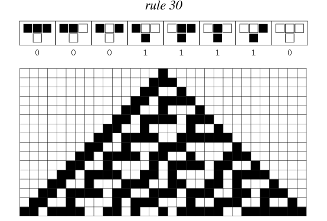

# Monads

### Monads {.fragile}

<blockquote class="twitter-tweet" data-lang="pt"><p lang="en" dir="ltr">there are entire subcultures of young men these days who just hang out online waiting for someone to ask a question about monads</p>&mdash; Monoid Mary (@argumatronic) <a href="https://twitter.com/argumatronic/status/1102441374857789440?ref_src=twsrc%5Etfw">4 de março de 2019</a></blockquote>
<script async src="https://platform.twitter.com/widgets.js" charset="utf-8"></script>

### Monads {.fragile}

O uso de Monads gerou diversos mitos entre os programadores por conta de seu uso em programação (não necessariamente em Haskell). 

### Monads {.fragile}

Isso motivou a criação de diversos tutoriais traçando uma analogia de Monads com outros conceitos [fora da computação](https://chrisdone.com/posts/monads-are-burritos) ou com enfoque em uma de suas [aplicações práticas](http://blog.sigfpe.com/2006/08/you-could-have-invented-monads-and.html).

### Monads {.fragile}

De acordo com o [Haskell wiki](https://wiki.haskell.org/What_a_Monad_is_not) e sumarizado no texto [What I wish I knew when learning Haskell](http://dev.stephendiehl.com/hask/#eightfold-path-to-monad-satori), um Monad **não**:

- Define funções impuras
- Cria e gerencia estados de sistema
- Permite sequenciamento imperativo
- Define IO
- É dependente de avaliação preguiçosa
- É uma porta dos fundos para efeito colateral
- É uma linguagem imperativa dentro do Haskell
- Necessita de conhecimento de matemática abstrata para entender
- Exclusivo do Haskell

### Monads {.fragile}

A dificuldade em entender Monads se dá por conta do pensamento imperativo que costuma ser nosso primeiro contato com programação.

### Monads {.fragile}

Vimos anteriormente o caso do nosso `Writer w a` que alterava a saída de nossas funções com um *embelezamento*, de forma a evitar transformar uma função pura em impura.

### Monads {.fragile}

Essa estrutura nos obrigou a criar um operador de composição específico para esses casos, gerando a Categoria Kleisli, que detalharemos em seguida.

### Categoria Kleisli {.fragile}

Relembrando nosso tipo `Writer`{.haskell} em Haskell:

```Haskell
data Writer w a = Writer (a, w)
```

### Categoria Kleisli {.fragile}

Podemos criar uma instância de Functor fazendo:

```Haskell
instance Functor (Writer w) where
  fmap f (Writer (a,w)) = Writer (f a, w)
```

### Categoria Kleisli {.fragile}

Utilizando esse tipo como saída de nossas funções temos que uma função `f :: a -> b`{.haskell} se torna uma função `f :: a -> Writer w b`{.haskell}. 

### Categoria Kleisli {.fragile}

Fazendo `Writer w = m`{.haskell}, temos o padrão:

```Haskell
f :: a -> m b

(>=>) :: (a -> m b) -> (b -> m c) -> (a -> m c)
```

### Categoria Kleisli {.fragile}

Podemos então pensar na categoria Kleisli ($\mathbf{K}$) como:

| Partindo de uma categoria $C$ e um endofunctor $m$, a categoria $\mathbf{K}$ possui os mesmos objetos de $C$, mas com morfismos $a \rightarrow b$ sendo mapeados para $a \rightarrow m b$ na categoria $C$.

### Categoria Kleisli {.fragile}

Para ser uma categoria precisamos de um operador de composição (já temos o nosso peixe) e um morfismo identidade $a \rightarrow a$, que na categoria $C$ é, na verdade, $a \rightarrow m a$. 

### Categoria Kleisli {.fragile}

Com isso, dizemos que $m$ é um Monad se:

```Haskell
class Monad m where
   (>=>)  :: (a -> m b) -> (b -> m c) -> (a -> m c)
   return :: a -> m a
``` 

### Categoria Kleisli {.fragile}

E apresenta as propriedades:

```{.haskell frame=lines framerule=2pt linenos=true fontsize=\footnotesize baselinestretch=0.8}
(f >=> g) >=> h = f >=> (g >=> h) = f >=> g >=> h
f >=> return = return >=> f = f
```

Em outras palavras, um Monad define como compor funções *embelezadas* e como colocar tipos dentro de um contexto.

### Categoria Kleisli {.fragile}

Como ficaria a instância completa do nosso Monad `Writer w`{.haskell}?

```{.haskell frame=lines framerule=2pt linenos=true fontsize=\footnotesize baselinestretch=0.8}
instance Monoid w => Monad (Writer w) where
  f >=> g = \a -> let Writer (b, s)  = f a
                      Writer (c, s') = g b
                  in  Writer (c, s `mappend` s')
  return a = Writer (a, mempty)
```

Indicando que `w` deve ser um Monoid, generalizamos a definição para outros tipos além de `String`{.haskell}. 

### Dissecando o Peixe {.fragile}

Podemos perceber um padrão dentro do nosso operador `>=>` que nos ajudará a simplificá-lo:

```Haskell
(>=>) :: (a -> m b) -> (b -> m c) -> (a -> m c)
f >=> g = \a -> let mb = f a
                in  ???
```

### Dissecando o Peixe {.fragile}

O que nos resta fazer é aplicar `g` em `mb` de tal forma a gerar um `m c`:

```Haskell
f >=> g = \a -> let mb = f a
                in  h mb g
                
h :: m b -> (b -> m c) -> m c
```

### Dissecando o Peixe {.fragile}

Vamos criar o seguinte operador:

```Haskell
(>>=) :: m a -> (a -> m b) -> m b
```

### Dissecando o Peixe {.fragile}

Que no caso do Monad `Writer w`{.haskell} fica:

```Haskell
(Writer (a,w)) >>= f = let Writer (b, w') = f a
                       in  Writer (b, w `mappend` w')
```

### Dissecando o Peixe {.fragile}

Tornando a definição do operador `>=>` como:

```Haskell
f >=> g = \a -> let mb = f a
                in  mb >>= g
```

### Dissecando o Peixe {.fragile}

Tornando a definição do operador `>=>` como:

```Haskell
f >=> g = \a -> (f a) >>= g
```

Muito mais simples! 

### Dissecando o Peixe {.fragile}

O operador `>>=` é conhecido como `bind` e define outra forma de instanciar um Monad:

```Haskell
class Monad m where
   (>>=)  :: m a -> (a -> m b) -> m b
   return :: a -> m a
``` 

### Dissecando o Peixe {.fragile}

Lembrando que um Monad também é um Functor, ele permite o uso de `fmap`. 

### Dissecando o Peixe {.fragile}

Se tivermos duas funções:

```Haskell
f :: a -> m b

fmap :: (a -> c) -> m a -> m c
```

Ao aplicar `fmap f ma` sendo `ma` um monad `m a`, o que teremos como saída?

### Dissecando o Peixe {.fragile}

```Haskell
f :: a -> m b

fmap f ma
fmap :: (a -> m b) -> m a -> m (m b)
```

Teremos como saída um tipo `m (m b)`. 

### Dissecando o Peixe {.fragile}

Precisamos de uma função que colapse a estrutura para apenas um Monad:

```Haskell
join :: m (m a) -> m a

ma >>= f = join (fmap f ma)
```

### Dissecando o Peixe {.fragile}

Com isso podemos definir um Monad também como:

```Haskell
class Monad m where
   join   :: m (m a) -> m a
   return :: a -> m a
```

### Dissecando o Peixe {.fragile}

A escolha de qual forma utilizar para instanciar um Monad depende da própria estrutura que queremos instanciar. Escolhemos o que for mais fácil definir e o resto é definido de graça! 

### Dissecando o Peixe {.fragile}

A função `join` do nosso Monad `Writer w`{.haskell} fica:

```Haskell
join (Writer (Writer (a, w), w')) 
               = Writer (a, w `mappend` w')
```

### Então... {.fragile}

Imagine que temos uma função `a -> b` e queremos transformá-la em `a -> m b`. No `Writer w` podemos fazer:

```Haskell
even :: Int -> Bool
even x = x `mod` 2 == 0

tell :: w -> Writer w ()
tell s = Writer ((), s)

evenW x = tell "even" >>= \() -> return (even x)
```

### Então... {.fragile}

Reparem que a função `\() -> return x` não faz uso do argumento de entrada, apenas altera o embelezamento da saída da função, podemos definir um operador específico para esses casos:

```Haskell
(>>) :: m a -> m b -> m b
ma >> mb = ma >>= \() -> mb
```

### Então... {.fragile}

Com esse operador, chamado de *then*, temos:

```{.haskell frame=lines framerule=2pt linenos=true fontsize=\footnotesize baselinestretch=0.8}
evenW x = tell "even" >> return (even x)
```

Esse operador descarta o argumento mas executa o *embelezamento* da função.

### Monads em outras linguagens

Monads estão aos poucos aparecendo nas linguagens de programação orientadas a objetos.

A linguagem C++ está introduzindo o conceito de *resumable functions* que o Python já implementa com `yield` e Haskell com *continuation Monad*.


# Exemplos de Monads

### Monads e Efeitos {.fragile}

Uma linguagem que somente aceita funções puras é útil?

### Monads e Efeitos {.fragile}

É possível minimizar o número de funções impuras, mas elas são necessárias para a entrada e saída dos dados. 

### Monads e Efeitos {.fragile}

Algumas das utilidades de funções impuras conforme listado no artigo de [Eugenio Moggi](https://core.ac.uk/download/pdf/21173011.pdf):

- **Não determinismo:** quando a computação pode retornar múltiplos resultados dependendo do caminho da computação.
- **Efeitos colaterais:** quando a computação acessa ou altera um estado como
  * Read-only, leitura do ambiente
  * Write-only, escrita de um log
  * Read/Write
- **Entrada e Saída Interativa**.
  
### Não-determinismo {.fragile}


### Não-determinismo {.fragile}

Se uma função pode retornar diferentes resultados, dependendo de certos estados internos, ela é chamada de não-determinística. 

### Não-determinismo {.fragile}

Uma função que avalia a melhor jogada de um jogo de xadrez deve levar em conta todas as possibilidades de jogadas do seu adversário.

### Não-determinismo {.fragile}

Esse tipo de computação pode ser representada como uma lista contendo todas as possibilidades de saída. 

Como no Haskell podemos trabalhar com listas infinitas (e a avaliação delas é preguiçosa), podemos usar o Monad `[]` para representar computações não-determinística.

### Não-determinismo {.fragile}

A instância Monad para listas é facilmente implementada pela função `join`:

```{.haskell frame=lines framerule=2pt linenos=true fontsize=\footnotesize baselinestretch=0.8}
instance Monad [] where
  join     = concat
  return x = [x]
```

### Não-determinismo {.fragile}

Essa definição é suficiente para o operador *bind*, que é definido como `as >>= k = concat (fmap k as)`{.haskell}. 

### Não-determinismo {.fragile}

Em versões futuras do C++ teremos o `range comprehensions` que implementa uma lista preguiçosa similar ao Haskell:

```{.cpp frame=lines framerule=2pt linenos=true fontsize=\footnotesize baselinestretch=0.8}
template<typename T, typename Fun>
static generator<typename std::result_of<Fun(T)>::type>
bind(generator<T> as, Fun k)
{
    for (auto a : as) {
        for (auto x : k(a) {
            __yield_value x;
        }
    }
}
```

### Não-determinismo {.fragile}

E no Python, utilizamos os generators:

```{.python frame=lines framerule=2pt linenos=true fontsize=\footnotesize baselinestretch=0.8}
def bind(xs, k):
    return (y for x in xs for y in k(x))
```

### Não-determinismo {.fragile}

Um exemplo da expressividade do Monad lista no Haskell é o cálculo de todas as triplas pitagóricas, que pode ser implementada como:

```Haskell
guard :: Bool -> [()]
guard True  = [()]
guard False = []

triples = [1..] >>= \z  -> [1..z] 
                >>= \x  -> [x..z] 
                >>= \y  -> guard (x^2 + y^2 == z^2) 
                >>  return (x, y, z)
```

### Não-determinismo {.fragile}

Que pode ser reescrita como:

```Haskell
triples = concat (fmap fz [1..])
fz z    = concat (fmap fx [1..z])
fx x    = concat (fmap fy [x..z])
fy y    = concat (fmap fg (guard (x^2 + y^2 == z^2)))
fg ()   = [(x, y, z)]
```

### Não-determinismo {.fragile}

```Haskell
triples = concat [fz 1, fz 2, fz 3 ..]
fz 1 = concat [fx 1]
fx 1 = concat [fy 1]
fy 1 = concat (fmap fg (guard 1 + 1 == 1))
fy 1 = concat (fmap fg [])
```

### Não-determinismo {.fragile}

```Haskell
triples = concat [[], [], [], [], fz 5 ..]
fz 5  = concat [fx 1, fx 2, fx 3, fx 4, fx 5]
fx 3  = concat [fy 3, fy 4, fy 5]
fy 4  = concat (fmap fg (guard 9 + 16 == 25))
fy 4  = concat (fmap fg [()])
fg () = [(3,4,5)]

triples = concat [[], [], [], [], [(3,4,5)] ..]
```

### Não-determinismo {.fragile}

O Haskell possui um *syntactic sugar* específico para listas, e essa mesma lista pode ser reescrita como:

```Haskell
triples = [(x,y,z) | z <- [1..]
                   , x <- [1..z]
                   , y <- [x..z]
                   , x^2 + y^2 == z^2]
```

### Não-determinismo {.fragile}

No Python podemos fazer uma construção similar como:

```Python
def triples(n):
  return ( (x,y,z) for z in range(1, n+1) 
                   for x in range(1, z+1)
                   for y in range(x, z+1)
                   if (x**2 + y**2 == z**2))
```

### Read-only {.fragile}

### Read-only {.fragile}

A leitura de um estado externo de um ambiente genérico `e` é interpretado como uma função que recebe não só o argumento original como um argumento extra codificando o ambiente `e`:


```Haskell
f :: (a, e) -> b
```

O embelezamento está no argumento da função.

### Read-only {.fragile}

Ao aplicar o *currying* nessa função temos que ela é equivalente a `f :: a -> (e -> b)`{.haskell}, ou seja, `f :: a -> Reader e b`{.haskell}. 

### Read-only {.fragile}

O Monad `Reader`{.haskell} faz o papel de manipulação de estados somente-leitura e vem equipado com as funções auxiliares `runReader`{.haskell}, que executa o `Reader`{.haskell} para um ambiente `e`{.haskell}, e `ask`{.haskell} que recupera tal ambiente.

### Read-only {.fragile}

```{.haskell frame=lines framerule=2pt linenos=true fontsize=\footnotesize baselinestretch=0.8}
data Reader e a = Reader (e -> a)

runReader :: Reader e a -> e -> a
runReader (Reader f) e = f e

ask :: Reader e e
ask = (Reader id)
```

### Read-only {.fragile}

Note que a definição do `Reader` e todas as funções que a utilizam são essencialmente puras, dada uma tabela grande o suficiente poderíamos memoizar todas as entradas e saídas possíveis para todo estado possível do ambiente `e`. 

### Read-only {.fragile}

Vamos começar a construção da definição de Monad pela função `return`:

```{.haskell frame=lines framerule=2pt linenos=true fontsize=\footnotesize baselinestretch=0.8}
return a = Reader (\e -> a)
```

Ou seja, dado um valor `a` qualquer ele simplesmente retorna esse valor para qualquer ambiente.

### Read-only {.fragile}

O *bind* do `Reader e` recebe um `Reader e a`{.haskell} e uma função `a -> Reader e b`{.haskell} e deve retornar um `Reader e b`{.haskell}.

### Read-only {.fragile}

Para isso deve fazer os seguintes passos:

1. executa `ra` no ambiente atual `e`, capturando o resultado puro `a`. 
2. aplica a função `k` em `a` que retorna um `Reader e b`. 
3. executa esse `Reader` no ambiente passado como argumento.

### Read-only {.fragile}

A definição de Monad para o `Reader e` fica:

```{.haskell frame=lines framerule=2pt linenos=true fontsize=\footnotesize baselinestretch=0.8}
instance Monad (Reader e) where
  -- (Reader e a) -> (a -> Reader e b) -> (Reader e b)
  -- (Reader f) >>= k = \e -> runReader (k (f e)) e
  ra >>= k = Reader (\e -> let a  = runReader ra e
                               rb = k a
                           in  runReader rb e)
                           
  return a = Reader (\e -> a)
```

### Read-only {.fragile}

A definição de nosso operador de composição fica:

```{.haskell frame=lines framerule=2pt linenos=true fontsize=\footnotesize baselinestretch=0.8}
(>=>) :: (a -> Reader e b) -> (b -> Reader e c) -> (a -> Reader e c)
f >=> g = \a -> (f a) >>= g
```

### Read-only {.fragile}

Imagine que temos um algoritmo que possui uma estrutura de configuração utilizada por uma função principal e funções auxiliares.

```{.haskell frame=lines framerule=2pt linenos=true fontsize=\footnotesize baselinestretch=0.8}
data Config = Conf { numberOfElems :: Int
                   , filtro        :: (Int -> Bool)
                   , transform     :: (Int -> Int)
                   }
```

### Read-only {.fragile}

```{.haskell frame=lines framerule=2pt linenos=true fontsize=\footnotesize baselinestretch=0.8}
recupera :: Config -> String -> [Int] -> [Int]
recupera (Conf nel f t) "filtra" xs     = filtra f t nel xs
recupera (Conf nel f t) "transforma" xs = transforma t nel xs

transforma :: (Int -> Int) -> Int -> [Int] -> [Int]
transforma t nel xs = take nel (fmap t xs)

filtra :: (Int-> Bool) -> (Int -> Int) -> Int -> [Int] -> [Int]
filtra f t nel xs = let fs = filter f xs
                        ts = fmap t fs
                    in  take nel ts
```

### Read-only {.fragile}

Para evitar ter que passar o parâmetro de configuração para todas as funções podemos definir `cfg` como uma variável global acessível por todas as funções. 

### Read-only {.fragile}

\centering
{width=400px}

### Read-only {.fragile}

Porém, se precisarmos carregar essas configurações de um arquivo externo, não podemos deixá-la como global no Haskell.

### Read-only {.fragile}

Nas linguagens que permitem o uso de variáveis globais, todas as funções que utilizam a estrutura de configuração em funções se tornariam impuras. Além disso devemos tomar cuidado para não alterar essa variável de nenhuma maneira!

### Read-only {.fragile}

Utilizando o `Reader` Monad podemos resolver essa situação da seguinte forma:

```{.haskell frame=lines framerule=2pt linenos=true fontsize=\footnotesize baselinestretch=0.8}
recupera' :: String -> [Int] -> Reader Config [Int]
recupera' "filtra" xs     = filtra' xs
recupera' "transforma" xs = transforma' xs
```

Tanto a função `filtra'` como a função `transforma'` retornam um `Reader Config [Int]`, ou seja, estão preparadas para ler a configuração externa.

### Read-only {.fragile}

```{.haskell frame=lines framerule=2pt linenos=true fontsize=\footnotesize baselinestretch=0.8}
transforma' :: [Int] -> Reader Config [Int]
transforma' xs = (fmap transform ask) >>= \t ->
                         (fmap numberOfElems ask) >>=
                               \n -> return (take n (fmap t xs))
```

não está nada bonito...

### Read-only {.fragile}

Primeiro ponto que podemos melhorar é perceber que o parâmetro `numberOfElems` é utilizado apenas por `take`, e o parâmetro `transform` apenas pelo `fmap`. Podemos então separar essas duas funções utilizando o operador peixe!

### Read-only {.fragile}

```{.haskell frame=lines framerule=2pt linenos=true fontsize=\footnotesize baselinestretch=0.8}
transforma' :: [Int] -> Reader Config [Int]
transforma' xs = (aplicaMap >=> pega) xs

aplicaMap  :: [Int] -> Reader Config [Int]
aplicaMap xs = fmap transform ask >>= \t -> return (fmap t xs)

pega :: [Int] -> Reader Config [Int]
pega xs = fmap numberOfElems ask >>= \n -> return (take n xs)
```

### Read-only {.fragile}

Agora vamos eliminar as repetições! O padrão `fmap param ask` pode ser substituído por:

```haskell
askFor p = fmap p ask
```

### Read-only {.fragile}

O padrão `\p -> return (f p xs)` pode ser reescrito como:

```haskell
\p -> return ((flip f) xs p)
\p -> (return . ((flip f) xs)) p
return . ((flip f) xs)
```

### Read-only {.fragile}

Com isso nosso `aplicaMap` e `pega` se tornam:

```{.haskell frame=lines framerule=2pt linenos=true fontsize=\footnotesize baselinestretch=0.8}
aplicaMap :: [Int] -> Reader Config [Int]
aplicaMap xs = askFor transform >>= return . fmapXS
  where fmapXS = (flip fmap) xs
                      
pega :: [Int] -> Reader Config [Int]
pega xs = askFor numberOfElems >>= return . takeXS
  where takeXS = (flip take) xs
```

### Read-only {.fragile}

Podemos também criar uma função `bindTo` que faz:

```Haskell
bindTo :: (Config -> a) -> (a -> b) 
       -> Reader Config b
bindTo p f = askFor p >>= return . f
```

### Read-only {.fragile}

Mas `Config -> a`{.haskell} é equivalente a `Reader Config a`{.haskell}:

```Haskell
bindTo :: Reader Config a -> (a -> b) 
       -> Reader Config b
bindTo p f = askFor p >>= return . f
```

### Read-only {.fragile}

Generalizando `Reader Config`{.haskell} para um Monad `m` qualquer:

```Haskell
bindTo :: m a -> (a -> b) -> m b
bindTo p f = askFor p >>= return . f
```

Se invertermos os argumentos,  o que obtemos?

```Haskell
?? :: (a -> b) -> m a -> m b
?? f p = askFor p >>= return . f
```

### Read-only {.fragile}

Com isso nosso `aplicaMap` e `pega` se tornam:

```{.haskell frame=lines framerule=2pt linenos=true fontsize=\footnotesize baselinestretch=0.8}
aplicaMap :: [Int] -> Reader Config [Int]
aplicaMap xs = fmap fmapXS (askFor transform)
  where fmapXS = (flip fmap) xs
                      
pega :: [Int] -> Reader Config [Int]
pega xs = fmap takeXS (askFor numberOfElems)
  where takeXS = (flip take) xs
```

### Read-only {.fragile}

Para executar o algoritmo precisamos fazer `runReader (algorithm xs) c`, sendo `c` a variável contendo a configuração.

### Read-only {.fragile}

Notem que a variável contendo a configuração não é passada diretamente para nenhum das funções do algoritmo, qualquer alteração que seja feita nessa estrutura ou no uso dela, não criará um efeito cascata de alterações no código. 

### Read-only {.fragile}

Em Python podemos fazer algo muito similar:

```{.python frame=lines framerule=2pt linenos=true fontsize=\footnotesize baselinestretch=0.8}
Conf = namedtuple('Conf', ['numberOfElems', 'filtro', 'transform'])

def numberOfElems(c):
  return c.numberOfElems
def filtro(c):
  return c.filtro
def transform(c):
  return c.transform
```

### Read-only {.fragile}

A classe Reader:

```{.python frame=lines framerule=2pt linenos=true fontsize=\footnotesize baselinestretch=0.8}
class Reader():
  # Reader e a
  def __init__(self, fun = None):
    self.r = fun

  def run(self, e):
    return self.r(e)

  # (a -> b) -> Reader e a -> Reader e b
  def fmap(self, f):
    return Reader(lambda e: f(self.r(e)))

  def unit(self, x):
    return Reader(lambda e: x)
```

### Read-only {.fragile}

A classe Reader (cont.):

```{.python frame=lines framerule=2pt linenos=true fontsize=\footnotesize baselinestretch=0.8}

  # Reader e a -> (a -> Reader e b) -> Reader e b
  def bind(self, fab):
    def f(e):
      a = self.r(e)
      rb = fab(a)
      return rb.run(e)
    return Reader(f)
```

### Read-only {.fragile}

E as funções auxiliares:

```{.python frame=lines framerule=2pt linenos=true fontsize=\footnotesize baselinestretch=0.8}
def composeMonad(f, g):
  def k(a):
    return f(a).bind(g)
  return k

def ask(e):
  return e

def askFor(f):
  return Reader(ask).fmap(f)
  
def bindTo(p, f):
    return askFor(p).bind(lambda x: Reader().unit(f(x)))
```

### Read-only {.fragile}

```{.python frame=lines framerule=2pt linenos=true fontsize=\footnotesize baselinestretch=0.8}
def recupera(tipo, xs):
  if tipo == "filtra":
    return filtra(xs)
  else:
    return transforma(xs)

def filtra(xs):
  f = composeMonad( composeMonad(aplicaFiltro, pega),
                    aplicaMap
                  )
  return f(xs)
  
def transforma(xs):
  f = composeMonad(pega, aplicaMap)
  return f(xs)
```

### Read-only {.fragile}

```{.python frame=lines framerule=2pt linenos=true fontsize=\footnotesize baselinestretch=0.8}
def aplicaFiltro(xs):
  filtroXS = lambda f: filter(f, xs)
  return askFor(filtro).fmap(filtroXS)

def aplicaMap(xs):
  mapXS = lambda f: map(f, xs)
  return askFor(transform).fmap(mapXS)

def pega(xs):
  pegaXS = lambda n: list(xs)[:n]
  return askFor(numberOfElems).fmap(pegaXS)
```

### Unread-only {.fragile}

A versão sem o uso de Monad possui menos funções, porém maiores. Vale a pena? \shrug

```{.python frame=lines framerule=2pt linenos=true fontsize=\footnotesize baselinestretch=0.8}
def recupera(tipo, config, xs):
  if tipo == "filtra":
    return filtra(config, xs)
  else:
    return transforma(config, xs)

def filtra(config, xs):
  n = config.numberOfElems
  f, t = config.filtro, config.transform
  ys = map(t, filter(f, xs))
  return list(ys)[:n]
  
def transforma(xs):
  n = config.numberOfElems
  t = config.transform
  ys = map(t, xs)
  return list(ys)[:n]
```

### State {.fragile}


### State {.fragile}

Um estado simplesmente é um ambiente $e$ que permite leitura e escrita, ou seja, é a combinação dos Monads `Reader`{.haskell} e `Writer`{.haskell} (chamados de **functores adjuntos**).

### State {.fragile}

Uma função `f :: a -> b`{.haskell} é embelezada para `f :: (a, s) -> (b, s)`{.haskell}, e utilizando *currying* temos `f :: a -> (s -> (b, s))`{.haskell}.

### State {.fragile}

Assim como o `Reader` ele é equipado com funções auxiliares:

```{.haskell frame=lines framerule=2pt linenos=true fontsize=\footnotesize baselinestretch=0.8}
data State s a = State (s -> (a, s))
               = Reader s (Writer s a)
               
runState :: State s a -> s -> (a, s)
runState (State f) s = f s

get :: State s s
get = State (\s -> (s, s))

put :: s -> State s ()
put s' = State (\s -> ((), s'))
```

### State {.fragile}

Com isso temos a capacidade de executar, ler ou alterar um estado. 

A instância de Monad nesse caso fica muito parecida com o Monad `Reader`, exceto que tomamos o cuidado de passar o novo estado para o próximo `runState`.

### State {.fragile}

Relembrando a instância de `Reader`:

```{.haskell frame=lines framerule=2pt linenos=true fontsize=\footnotesize baselinestretch=0.8}
instance Monad (Reader e) where
  -- (Reader e a) -> (a -> Reader e b) -> (Reader e b)
  ra >>= k = Reader (\e -> let a  = runReader ra e
                               rb = k a
                           in  runReader rb e)
                           
  return a = Reader (\e -> a)
```

### State {.fragile}

Agora trabalhamos com um estado `s`:

```{.haskell frame=lines framerule=2pt linenos=true fontsize=\footnotesize baselinestretch=0.8}
instance Monad (State s) where
  -- (State s a) -> (a -> State s b) -> (State s b)
  ra >>= k = State (\s -> let a  = runState ra s
                              rb = k a
                           in runState rb s)
                           
  return a = State (\s -> a)
```

### State {.fragile}

Porém, agora as funções retornam um novo estado:

```{.haskell frame=lines framerule=2pt linenos=true fontsize=\footnotesize baselinestretch=0.8}
instance Monad (State s) where
  -- (State s a) -> (a -> State s b) -> (State s b)
  sa >>= k = State (\s -> let (a, s') = runState sa s 
                              rb      = k a
                          in  runState rb s')
                          
  return a = State (\s -> (a, s))
```

### State {.fragile}

Equivalente em Python:

```{.python frame=lines framerule=2pt linenos=true fontsize=\footnotesize baselinestretch=0.8}
class State:
  # State s -> (a, s)
  def __init__(self, f = None):
    self.r = f

  def run(self, s):
    return self.r(s)

  def unit(self, x):
    return State(lambda s: (x, s))

  def bind(self, k):
    def f(s):
      (a, sn) = self.run(s)
      return k(a).run(sn)
    return State(f)
    
  def fmap(self, f):
    def applySt(f, st):
      return (f(st[0]), st[1])
    return State(lambda s: applySt(f,self.r(s)))
```

### State {.fragile}

Uma aplicação desse Monad é na manipulação de números aleatórios em que queremos que o estado do gerador seja atualizado a cada chamada da função `random`. 

### State {.fragile}

Vamos exemplificar com uma função que alterar uma lista de `Bool`, invertendo cada um de seus elementos, caso um certo valor aleatório seja `< 0.3`.

### State {.fragile}

```{.haskell frame=lines framerule=2pt linenos=true fontsize=\footnotesize baselinestretch=0.8}
import Control.Monad
import Control.Monad.State
import System.Random

randomSt :: (RandomGen g) => State g Double
randomSt = state (randomR (0.0, 1.0))
   
change :: Bool -> Double -> Bool
change b p = if p < 0.3 then not b else b

booleanos :: [Bool] -> State StdGen [Bool]
booleanos bs = ???
```

### State {.fragile}

Vamos pensar em como alterar um único booleano aleatoriamente:

```{.haskell frame=lines framerule=2pt linenos=true fontsize=\footnotesize baselinestretch=0.8}
import Control.Monad
import Control.Monad.State
import System.Random

randomSt :: (RandomGen g) => State g Double
randomSt = state (randomR (0.0, 1.0))
   
change :: Bool -> Double -> Bool
change b p = if p < 0.3 then not b else b

changeAtRandom :: Bool -> State g Bool
changeAtRandom b = fmap (change b) randomSt
```

### State {.fragile}

Agora precisamos criar uma lista desses booleanos:

```{.haskell frame=lines framerule=2pt linenos=true fontsize=\footnotesize baselinestretch=0.8}
booleanos :: [Bool] -> [State g Bool]
booleanos bs = [changeAtRandom b | b <- bs]
```

hmmm, mas eu queria na verdade um `State g [Bool]`{.haskell}

### State {.fragile}

Preciso de uma função que execute as ações de gerar um número aleatório na sequência da lista. Não queremos executar usando o mesmo estado para todos os elementos...

### State {.fragile}

Se a lista está vazia é fácil resolver!

```{.haskell frame=lines framerule=2pt linenos=true fontsize=\footnotesize baselinestretch=0.8}
sequence :: [State g Bool] -> State g [Bool]
sequence []     = return []
```

### State {.fragile}

```{.haskell frame=lines framerule=2pt linenos=true fontsize=\footnotesize baselinestretch=0.8}
sequence :: [State g Bool] -> State g [Bool]
sequence []     = return []
-- b' :: Bool
sequence (b:bs) = b >>= \b' -> ??
```

### State {.fragile}

```{.haskell frame=lines framerule=2pt linenos=true fontsize=\footnotesize baselinestretch=0.8}
sequence :: [State g Bool] -> State g [Bool]
sequence []     = return []
-- sequence bs :: State g [Bool]
sequence (b:bs) = b >>= \b' -> sequence bs
```

### State {.fragile}

```{.haskell frame=lines framerule=2pt linenos=true fontsize=\footnotesize baselinestretch=0.8}
sequence :: [State g Bool] -> State g [Bool]
sequence []     = return []
-- bs' :: [Bool]
sequence (b:bs) = b >>= \b' -> sequence bs >>= \bs' -> ???
```

### State {.fragile}

```{.haskell frame=lines framerule=2pt linenos=true fontsize=\footnotesize baselinestretch=0.8}
sequence :: [State g Bool] -> State g [Bool]
sequence []     = return []
-- (b':bs') :: [Bool]
sequence (b:bs) = b >>= \b' -> sequence bs 
                       >>= \bs' -> ?? (b':bs')
```

### State {.fragile}

```{.haskell frame=lines framerule=2pt linenos=true fontsize=\footnotesize baselinestretch=0.8}
sequence :: [State g Bool] -> State g [Bool]
sequence []     = return []
-- return (b':bs') :: State g [Bool]
sequence (b:bs) = b >>= \b' -> sequence bs 
                       >>= \bs' -> return (b':bs')
```

### State {.fragile}

Com isso nossa função `booleanos` se torna:

```{.haskell frame=lines framerule=2pt linenos=true fontsize=\footnotesize baselinestretch=0.8}
booleanos :: [Bool] -> State g [Bool]
booleanos bs = sequence [changeAtRandom b | b <- bs]

main = do
  g <- getStdGen
  let bs = replicate 20 True
  print (fst $ runState (booleanos bs) g)
```

### State {.fragile}

Imagine que agora também temos as seguintes funções:

```{.haskell frame=lines framerule=2pt linenos=true fontsize=\footnotesize baselinestretch=0.8}
select b p = if (p < 0.3 && b) then [b] else []

selection :: [Bool] -> State StdGen [Bool]
selection bs = fmap concat bs'
  where bs' = sequence rbs
        rbs = [fmap (select b) randomSt | b <- bs]
```

E ela deve ser aplicada na saída da função `booleanos`.

### State {.fragile}

```{.haskell frame=lines framerule=2pt linenos=true fontsize=\footnotesize baselinestretch=0.8}
(booleanos bs) :: State StdGen [Bool]
selection :: [Bool] -> State StdGen [Bool]
```

O que fazemos?

### State {.fragile}

```{.haskell frame=lines framerule=2pt linenos=true fontsize=\footnotesize baselinestretch=0.8}
booleanos bs >>= selection
```

### State {.fragile}

Em Python podemos escrever:

```{.python frame=lines framerule=2pt linenos=true fontsize=\footnotesize baselinestretch=0.8}
import random
from functools import partial

def change(b, p):
  if p < 0.3:
    return not b
  return b
  
def mutation(bs):
  return sequence([myRandST.fmap(partial(change,b)) 
                         for b in bs])  
```

### State {.fragile}

Em Python podemos escrever:

```{.python frame=lines framerule=2pt linenos=true fontsize=\footnotesize baselinestretch=0.8}
import random
from functools import partial

def select(b, p):
  if p < 0.3 and b:
    return [b]
  return []
  
def concat(xss):
  return [x for xs in xss 
              for x in xs]
              
def selection(bs):
  return sequence([myRandST.fmap(partial(select,b)) 
                         for b in bs]).fmap(concat)
```

### State {.fragile}

A função `sequence` é escrita em Python como:

```{.python frame=lines framerule=2pt linenos=true fontsize=\footnotesize baselinestretch=0.8}
# [State bool] -> State [bool]
def sequence(ss):
  def f(s):
    xs = []
    for si in ss:
      (x, s) = si.run(s)
      xs.append(x)
    return (xs, s)
  return State(f)
```

### State {.fragile}

E o restante do programa fica:

```{.python frame=lines framerule=2pt linenos=true fontsize=\footnotesize baselinestretch=0.8}
def myRand(s):
  random.setstate(s)
  x = random.random()
  return x, random.getstate()

myRandST = State(myRand)

bs = [True]*10
bs1 = (mutation(bs)
        .bind(selection)
        .run(random.getstate())
      )

print( bs, bs1[0] )
```

### State {.fragile}

```{.python frame=lines framerule=2pt linenos=true fontsize=\footnotesize baselinestretch=0.8}

def mutation(bs):
  return [change(b, random()) for b in bs]
  
def select(b, p):
  if p < 0.3 and b:
    return True
  return False
  
def selection(bs):
  return [b for b in bs if select(b, random())]
  
bs1 = selection(mutation(bs))
```

### State {.fragile}

Poderíamos fazer uma observação similar ao `Reader` monad, porém notem que a função `random()` altera um estado global do programa. 

### State {.fragile}

Pensando no mesmo programa com a passagem de estado como parâmetro, teríamos algo como:

```{.python frame=lines framerule=2pt linenos=true fontsize=\footnotesize baselinestretch=0.8}

def mutation(bs, s):
  nbs = []
  for b in bs:
    (p, s) = random(s)
    nbs.append(change(b, p))
  return nbs, s
  
def selection(bs, s):
  nbs = []
  for b in bs:
    (p, s) = random(s)
    nbs.append(select(b, p))
  return nbs, s
  
(bs1, s) = mutation(bs, s)
(bs2, s) = selection(b, s)
```

### IO {.fragile}

### IO {.fragile}

Quando dizemos que Haskell é uma linguagem de programação puramente funcional e **todas** suas funções são puras, a primeira questão que vem na mente é de como as funções de entrada e saída são implementadas. 

### IO {.fragile}

Como as funções `getChar, putChar` podem ser puras se elas dependem do efeito colateral? Como é possível compor funções puras com a saída de `getChar` se a saída é, teoricamente, indeterminada?

### IO {.fragile}

O segredo das funções de manipulação de `IO` é que elas tem seus valores guardados dentro de um container (o `IO` Monad) que nunca pode ser aberto. 

### IO {.fragile}

Ou seja, criamos funções que lidam com `Char` sem saber exatamente quem é esse caracter. 

### IO {.fragile}

Podemos imaginar o Monad `IO` como uma caixa quântica contendo uma superposição de todos os valores possíveis de um tipo. 

### IO {.fragile}

Toda chamada de função para esse tipo é **jogada lá dentro** e executada pelo sistema operacional quando apropriado.

### IO {.fragile}

As assinaturas de `getChar` e `putChar` são:

```Haskell
getChar :: IO Char -- () ->  IO Char

putChar :: Char :: IO ()
```

### IO {.fragile}

Note que a implementação da instância de Functor e Monad para `IO` é implementada internamente no Sistema Operacional e não temos um `runIO` que nos devolve um valor contido no container.

### IO {.fragile}

Ao fazer `fmap f getChar` a função será executada no retorno de `getChar` mas não poderemos ver seu resultado. 

### IO {.fragile}

Uma outra forma de pensar no `IO` é como um tipo `State`:

```Haskell
data IO a = Mundo -> (a, Mundo) = State Mundo a
```

### IO {.fragile}

A sequência:

```Haskell
do putStr "Hello"
   putStr "World"
```

Causa uma dependência funcional entre as duas funções de tal forma que elas serão executadas na sequência.

### Uma palavra final sobre Monads {.fragile}

Em resumo, Monads nos permite colocar um valor dentro de um contexto e criar funções que colocam valores dentro desse contexto sem perder a propriedade de composição:

```Haskell
a -> m b
```

mas ele não nos garante que podemos retirar o conteúdo do contexto...

# Comonads

### Comonads {.fragile}

A categoria oposta da Kleisli, denominada **co-Kleisli** leva ao conceito de **Comonads**. 

Agora temos endofunctors `w` e morfismos do tipo `w a -> b`.

### Comonads {.fragile}

Queremos definir um operador de composição para eles, da mesma forma que definimos o operador `>=>`:

```Haskell
(=>=) :: (w a -> b) -> (w b -> c) -> (w a -> c)
```

### Comonads {.fragile}

Nosso morfismo identidade é similar ao `return` mas com a seta invertida:

```Haskell
extract :: w a -> a
```

`extract` permite extrair um conteúdo do functor `w` (nosso container). 

### Comonads {.fragile}

O oposto de nosso operador `bind`{.haskell}, chamado de `extend` (`=>>`) tem assinatura assinatura:

```haskell
(=>>) :: (w a -> b) -> w a -> w b
```

Seja `f` uma função que retira um `a` do container `w` e transforma em `b`, dado um `w a`, me retorne um `w b`.

### Comonads {.fragile}

Finalmente, o oposto de `join` é o `duplicate`:

```haskell
duplicate :: w a -> w (w a)
```

ela insere um container dentro de outro container

### Comonads {.fragile}

Nesse ponto, podemos perceber a dualidade entre Monad e Comonad. 

### Comonads {.fragile}

O Monad nos dá uma forma de colocar valores dentro de containers, mas sem garantias de que podermos retirá-los.

O valor fica envolvido em um contexto que pode ficar escondido até o fim.

### Comonads {.fragile}

O Comonad dá uma forma de retirar um valor de um container, sem prover uma forma de colocá-lo de volta.

Podemos focar em um elemento e manter todo o contexto em volta dele (e já vimos isso nos tipos buracos!).

### Comonads {.fragile}

Então nossa classe Comonad é definida por:

```{.haskell frame=lines framerule=2pt linenos=true fontsize=\footnotesize baselinestretch=0.8}
class Functor w => Comonad w where
    extract   :: w a -> a
    
    (=>=)     :: (w a -> b) -> (w b -> c) -> (w a -> c)
    f =>= g = g . (f =>>)
    
    (=>>)     :: (w a -> b) -> w a -> w b
    f =>> wa = fmap f . duplicate
    
    duplicate :: w a -> w (w a)
    duplicate = (id =>>)
```

### Definições padrão {.fragile}

A ideia de um Comonad é que você possui um container com um ou mais valores de `a` e que existe uma noção de *valor atual* ou *foco* em um dos elementos. 

Esse valor atual é acessado pela função `extract`. 

### Definições padrão {.fragile}

O operador *co-peixe* (`=>=`) faz alguma computação no valor atual porém tendo acesso a tudo que está em volta dele. 

### Definições padrão {.fragile}

A função `duplicate` cria diversas versões de `w a` com os diferentes focos.

### Definições padrão {.fragile}

A função `extend` (`=>>`) aplica uma função em todas as possibilidades de foco.

### Stream de Dados {.fragile}

Podemos definir um Stream de dados como uma lista infinita não-vazia:

```{.haskell frame=lines framerule=2pt linenos=true fontsize=\footnotesize baselinestretch=0.8}
data Stream a = Cons a (Stream a)

instance Functor Stream where
  fmap f (Cons a as) = Cons (f a) (fmap f as)
```

### Stream de Dados {.fragile}

Essa estrutura possui um foco em seu primeiro elemento. 

Podemos definir a função `extract` simplesmente como:

```{.haskell frame=lines framerule=2pt linenos=true fontsize=\footnotesize baselinestretch=0.8}
extract (Cons a _) = a
```

### Stream de Dados {.fragile}

A função `duplicate` deve gerar uma Stream de Streams, cada uma com um foco diferentes:

```{.haskell frame=lines framerule=2pt linenos=true fontsize=\footnotesize baselinestretch=0.8}
duplicate (Cons a as) = Cons (Cons a as) (duplicate as)
```

### Stream de Dados {.fragile}

Com isso temos as funções necessárias para criar uma instância de Comonad para Streams:

```{.haskell frame=lines framerule=2pt linenos=true fontsize=\footnotesize baselinestretch=0.8}
instance Comonad Stream where
  extract (Cons a _)    = a
  duplicate (Cons a as) = Cons (Cons a as) (duplicate as)
```

### Stream de Dados {.fragile}

Como exemplo de aplicação vamos criar uma função que calcula a média móvel de um stream de dados. 

### Stream de Dados {.fragile}

Começamos com a definição da média entre os $n$ próximos elementos:

```{.haskell frame=lines framerule=2pt linenos=true fontsize=\footnotesize baselinestretch=0.8}
sumN :: Num a => Int -> Stream a -> a
sumN n (Cons a as) | n <= 0    = 0
                   | otherwise = a + sumN (n-1) as
                   
avgN :: Fractional a => Int -> Stream a -> a
avgN n as = (sumN n as) / (fromIntegral n)
```

### Stream de Dados {.fragile}

Notem que `avgN` tem assinatura `Int -> (w a -> a)`, para gerarmos uma Stream de médias móveis queremos algo como `Int -> (w a -> a) -> w a -> w a`, que remete a assinatura de `=>>`:

```{.haskell frame=lines framerule=2pt linenos=true fontsize=\footnotesize baselinestretch=0.8}
movAvg :: Fractional a => Int -> Stream a -> Stream a
movAvg n as = (avgN n) =>> as
```

### Stream de Dados {.fragile}

Com isso, a função `avgN n` será aplicada em cada foco de `as` gerando uma nova Stream contendo apenas os valores das médias.

### Store Comonad {.fragile}

Relembrando o `State` Monad visto anteriormente, ele foi definido como a composição `(Reader s) . (Writer s)`:

```{.haskell frame=lines framerule=2pt linenos=true fontsize=\footnotesize baselinestretch=0.8}
data State s a = State (s -> (a, s))
               = Reader s (Writer s a)
```

Isso foi possível pois os Functors `Reader` e `Writer` são adjuntos. 

### Store Comonad {.fragile}

De forma análoga podemos fazer a composição dual para criarmos um Comonad:

```{.haskell frame=lines framerule=2pt linenos=true fontsize=\footnotesize baselinestretch=0.8}
data Store s a = Store (s -> a) s
               = Writer s (Reader s a)
```

### Store Comonad {.fragile}

A instância de Functor para esse Comonad é simplesmente a composição da função definida por `Reader s a`:

```{.haskell frame=lines framerule=2pt linenos=true fontsize=\footnotesize baselinestretch=0.8}
instance Functor (Store s) where
  fmap g (Store f s) = Store (g . f) s
```

### Store Comonad {.fragile}

A assinatura de `extract` deve ser `Store s a -> a`, sendo que o tipo `Store` armazena uma função `s -> a` e um `s`, basta aplicar a função no estado `s` que ele armazena. 

### Store Comonad {.fragile}

Por outro lado, a função `duplicate` pode se aproveitar da aplicação parcial na construção de um valor definindo:

```{.haskell frame=lines framerule=2pt linenos=true fontsize=\footnotesize baselinestretch=0.8}
instance Comonad (Store s) where
  extract (Store f s)   = f s
  duplicate (Store f s) = Store (Store f) s
```

### Store Comonad {.fragile}

O Comonad `Store` é um par que contém um container (a função **f**) que armazena diversos elementos do tipo **a** indexados pelo tipo **s** e um **s** que indica o foco atual da estrutura.

### Store Comonad {.fragile}

Nessa interpretação temos que `extract` retorna o elemento `a` na posição atual `s` e `duplicate` simplesmente cria infinitas cópias desse container de tal forma que cada cópia está deslocada em $n$ posições para direita ou para a esquerda.

### Store Comonad em Python {.fragile}

```{.python frame=lines framerule=2pt linenos=true fontsize=\footnotesize baselinestretch=0.8}
class Store:
  def __init__(self, f, s):
    self.f, self.s = f, s

  def extract(self):
    return self.f(self.s)

  def duplicate(self):
    return Store(lambda s: Store(self.f, s), self.s)
```

### Store Comonad em Python (cont.) {.fragile}

```{.python frame=lines framerule=2pt linenos=true fontsize=\footnotesize baselinestretch=0.8}
  def fmap(self, g):
    f = lambda s: g(self.f(s))
    return Store(f, self.s)

  def extend(self, g):
    return self.duplicate().fmap(g)
```

### Store Comonad {.fragile}

Como exemplo, vamos implementar o automato celular 1D conforme descrito por [Wolfram](https://www.wolframscience.com/). 

### Store Comonad {.fragile}

Esse automato inicia com uma lista infinita indexada por valores inteiros (positivos e negativos) e centralizada em $0$. 

A lista contém inicialmente o valor $1$ na posição central e $0$ em todas as outras posições.

### Store Comonad {.fragile}

A cada passo da iteração, a lista é atualizada através das `regras n` em que $0 \leq n \leq 255$. 

A numeração da regra codificam um mapa de substituição para o número binário formado pela subslita composta do valor atual e de seus dois vizinhos. 

### Store Comonad {.fragile}

Por exemplo, a regra 30 codifica:

{width=400px}

### Store Comonad {.fragile}

Podemos implementar esse autômato utilizando um `Store Int Int`, primeiro definindo a função que aplica a regra:

```{.python frame=lines framerule=2pt linenos=true fontsize=\footnotesize baselinestretch=0.8}
# Int -> Store Int Int -> Int
def rule(x, fs):
  revBin = bin(x)[2:][::-1]
  bit = 4*fs.f(fs.s-1) + 2*fs.f(fs.s) + fs.f(fs.s+1)

  if bit >= len(revBin):
    return 0
  return revBin[bit]
```

### Store Comonad {.fragile}

Fazendo uma aplicação parcial do número da regra, a assinatura da função fica: `Store Int Int -> Int` que deve ser aplicada em um `Store Int Int` para gerar a próxima função de indexação. 

### Store Comonad {.fragile}

Isso sugere o uso de `extend` (`=>>`):

```{.python frame=lines framerule=2pt linenos=true fontsize=\footnotesize baselinestretch=0.8}
def nextStep(rl, fs):
  return fs.extend(rl)
```

### Store Comonad {.fragile}

Mas queremos aplicar sucessivamente essa regra:

```{.python frame=lines framerule=2pt linenos=true fontsize=\footnotesize baselinestretch=0.8}
def wolfram(rl, fs):
  while True:
    yield fs
    fs = fs.extend(rl)
```

### Store Comonad {.fragile}

A representação inicial de nosso ambiente é feita por:

```{.haskell frame=lines framerule=2pt linenos=true fontsize=\footnotesize baselinestretch=0.8}
def f0(x):
  if x==0:
    return 1
  return 0

fs = Store(f0, 0)
```

### Store Comonad {.fragile}

E, então, criamos nosso automato com a regra $30$ fazendo:

```{.haskell frame=lines framerule=2pt linenos=true fontsize=\footnotesize baselinestretch=0.8}
wolf30 = wolfram(partial(rule, 30), fs)
top5 = itertools.islice(wolf30, 6)

for w in top5:
  print(w)
```

### Store Comonad {.fragile}

O Comonad Store pode ser aplicado com funções de $n$-variáveis, então não estamos limitados a containers unidimensionais.

### Store Comonad {.fragile}

Por exemplo, podemos representar uma imagem bitmap como um Store e aplicar uma sequência de filtros da seguinte forma:

```python
(img.extend(sharpen)
    .extend(emboss)
)
```

```haskell
img =>> sharpen =>> emboss
```

### Store Comonad {.fragile}

Os filtros precisam podem ser facilmente construídos através apenas da matriz de convolução!

# Atividades para Casa

### Atividades para Casa

1. Alguns Functors possuem instâncias de Monad e Comonad, escreva essas instâncias (na linguagem que preferir) para:
  a. Functor Identity
  b. O tipo lista não-vazia `data FullList a = Single a | Cons a (FullList a)`
  
2. Complete o código *ConvEx.py* para criar a aplicação de kernel de convolução utilizando o Comonad Store.
